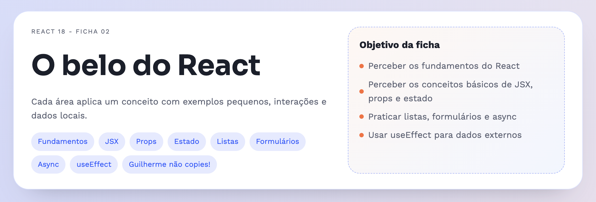
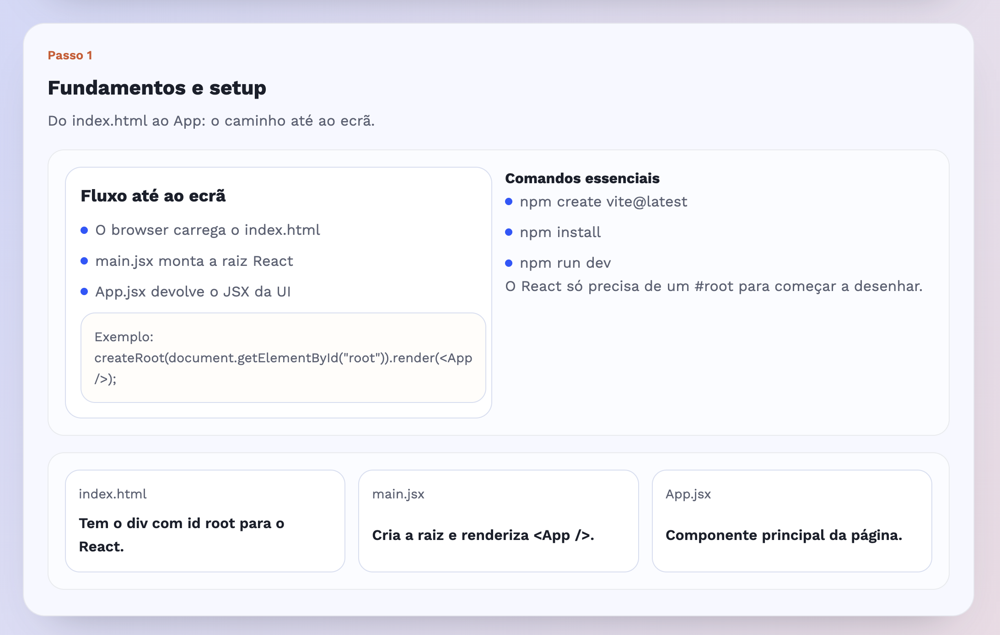
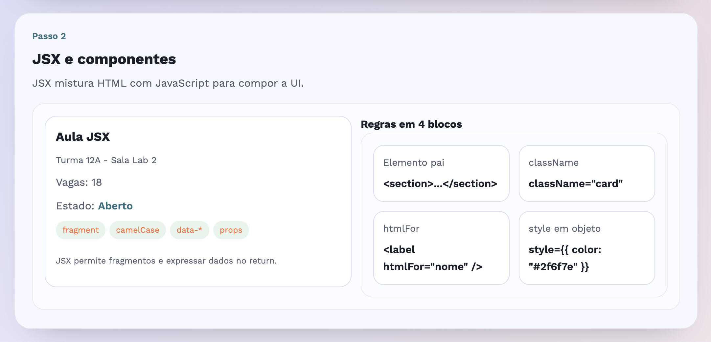
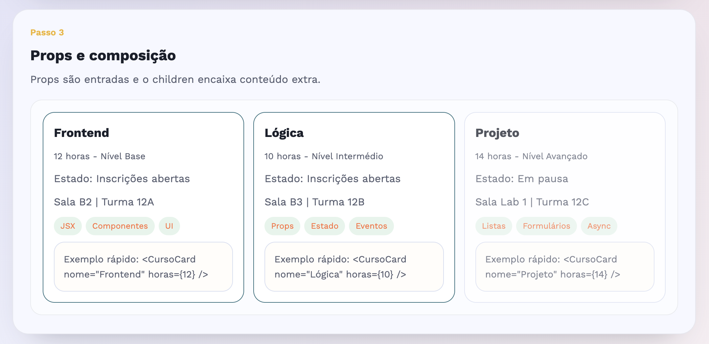
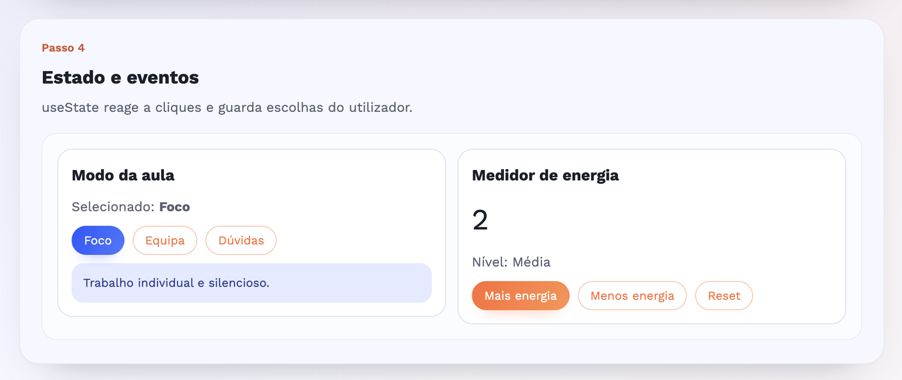
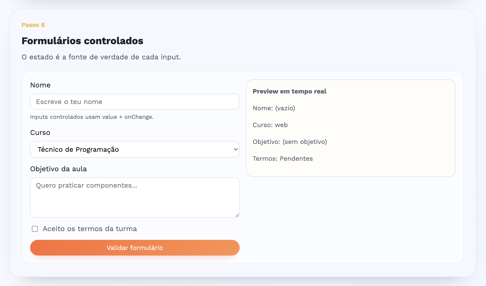
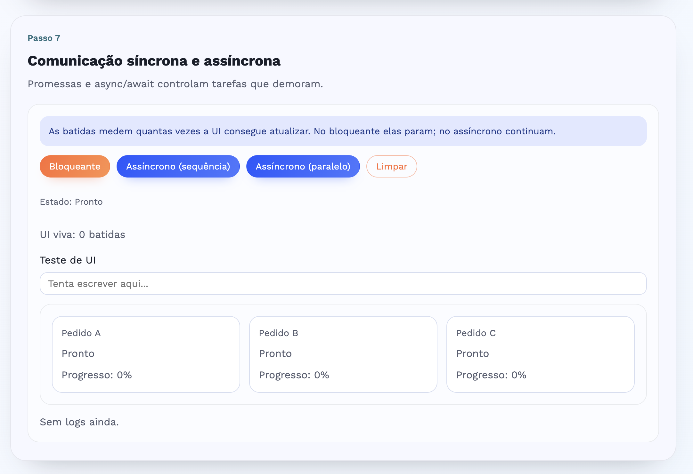

# Tutorial passo a passo - React Laboratório (Ficha 02) (12.º ano)

Este tutorial explica, do início ao fim, como criar o projeto **react-ficha-02**.
O objetivo é treinar **8 temas de React** de forma gradual, com exemplos simples, visuais e interativos.

> Tudo será feito com **React + Vite**. O projeto é só frontend (sem backend).

---

## 0) O que vais construir


Uma página com **8 secções**, cada uma a demonstrar um conceito:

1. Fundamentos e setup
2. JSX e componentes
3. Props e composição
4. Estado e eventos
5. Listas e condicionais
6. Formulários controlados
7. Comunicação síncrona e assíncrona
8. useEffect e dados externos

Nesta ficha, cada secção **já vem “embrulhada”** num componente `Section` (um layout reutilizável).
Ou seja: o `App.jsx` só precisa de “montar” os blocos pela ordem certa.

Estrutura (resumo):

- `src/components/` → componentes de layout (PageHeader, Section, etc.)
- `src/sections/` → as 8 secções da ficha
- `public/mini-data.json` → dados para o exemplo do `fetch`
- `src/styles.css` → estilos globais

---

## 1) Pré-requisitos

Antes de começar, confirma que tens:

- Node.js (versão 18 ou superior)
- npm (vem com o Node)
- Um editor de código (VS Code, por exemplo)
- Terminal aberto na pasta onde vais criar o projeto

Para confirmar Node e npm:

```bash
node -v
npm -v
```

---

## 2) Criar o projeto base com Vite

1. No terminal, cria o projeto com Vite:

```bash
npm create vite@latest react-ficha-02 -- --template react
```

2. Entra na pasta:

```bash
cd react-ficha-02
```

3. Instala dependências:

```bash
npm install
```

4. Abre a pasta no VS Code.

> Se a pasta já existir, usa outro nome (ex: `react-ficha-02-2`).

---

## 3) Limpeza inicial do projeto

O Vite cria ficheiros de exemplo. Vamos simplificar.

1. Apaga o ficheiro `src/App.css` (não vamos usar).
2. Apaga os assets de exemplo (`src/assets`) se existirem.
3. O `src/main.jsx` vai manter a mesma ideia (React ligado ao `#root`), mas vamos garantir que importa `styles.css`.

No final, queremos algo deste género no projeto:

```
react-ficha-02/
├─ index.html
├─ package.json
├─ public/
│  └─ mini-data.json
└─ src/
   ├─ App.jsx
   ├─ main.jsx
   ├─ styles.css
   ├─ components/
   │  ├─ PageHeader.jsx
   │  └─ Section.jsx
   └─ sections/
      ├─ Fundamentos.jsx
      ├─ JsxComponentes.jsx
      ├─ PropsComposicao.jsx
      ├─ EstadoEventos.jsx
      ├─ ListasCondicionais.jsx
      ├─ FormulariosControlados.jsx
      ├─ AsyncBasico.jsx
      └─ UseEffectDados.jsx
```

---

## 4) Garantir o ponto de entrada (main.jsx)

Edita `src/main.jsx` para garantir que:

- Importa `App.jsx`
- Importa `styles.css`
- Renderiza `<App />` dentro do `div#root`

```jsx
import React from "react";
import ReactDOM from "react-dom/client";
import App from "./App.jsx";
import "./styles.css";

ReactDOM.createRoot(document.getElementById("root")).render(
    <React.StrictMode>
        <App />
    </React.StrictMode>,
);
```

O que isto faz:

- Liga o React ao `div#root` do `index.html`.
- Diz ao React para “desenhar” o componente `App` dentro desse `div`.
- Carrega os estilos globais (`styles.css`).

---

## 5) Confirmar o index.html

Abre `index.html` e confirma que tens um `div` com id `root`.

```html
<!DOCTYPE html>
<html lang="pt">
    <head>
        <meta charset="UTF-8" />
        <meta name="viewport" content="width=device-width, initial-scale=1.0" />
        <title>React Ficha 02 - Laboratorio</title>
    </head>
    <body>
        <div id="root"></div>
        <script type="module" src="/src/main.jsx"></script>
    </body>
</html>
```

> Este `div#root` começa vazio. É o React que vai preencher a página. Basicamente é aqui que o React coloca tudo o que desenha.
> Ao abrir o `index.html`, o browser carrega o `main.jsx`, que por sua vez monta o `App.jsx` dentro do `div#root`.

---

## 6) Criar os estilos base (styles.css)

Cria (ou substitui) `src/styles.css` com o estilo base.
Isto ajuda a ficha a ficar bem “legível” e os alunos a perceberem melhor os blocos.

> Sim: o ficheiro é grande, mas é só CSS. Não precisas decorar. Podes até copiar e colar.
> A ideia é dar um layout consistente para todos os passos.

```css
@import url("https://fonts.googleapis.com/css2?family=Sora:wght@600;700&family=Work+Sans:wght@400;500;600;700&display=swap");

:root {
    --bg: #eef4ff;
    --surface: #f7f8ff;
    --surface-strong: #ffffff;
    --ink: #1a1f2b;
    --muted: #5a6072;
    --accent: #ff6b35;
    --accent-2: #2457ff;
    --accent-3: #2bb673;
    --line: #d7def1;
    --shadow: 0 24px 48px -32px rgba(26, 31, 43, 0.4);
}

* {
    box-sizing: border-box;
}

body {
    margin: 0;
    font-family: "Work Sans", "Trebuchet MS", sans-serif;
    color: var(--ink);
    background-color: var(--bg);
    background-image:
        radial-gradient(
            circle at 10% 10%,
            rgba(36, 87, 255, 0.16),
            transparent 45%
        ),
        radial-gradient(
            circle at 90% 20%,
            rgba(255, 107, 53, 0.16),
            transparent 45%
        ),
        linear-gradient(135deg, #eef4ff 0%, #f7f9ff 55%, #eef7ff 100%);
    line-height: 1.6;
}

.page {
    min-height: 100vh;
    padding: 42px 20px 80px;
    position: relative;
    overflow: hidden;
}

.page::before,
.page::after {
    content: "";
    position: absolute;
    width: 320px;
    height: 320px;
    border-radius: 50%;
    background: radial-gradient(
        circle,
        rgba(36, 87, 255, 0.22),
        transparent 70%
    );
    animation: float 11s ease-in-out infinite;
    z-index: 0;
}

.page::before {
    top: -60px;
    right: -120px;
}

.page::after {
    bottom: -120px;
    left: -90px;
    animation-delay: 3s;
    background: radial-gradient(
        circle,
        rgba(255, 107, 53, 0.22),
        transparent 70%
    );
}

.content {
    max-width: 1040px;
    margin: 0 auto;
    display: grid;
    gap: 28px;
    position: relative;
    z-index: 1;
}

.hero {
    max-width: 1040px;
    margin: 0 auto 32px;
    background: var(--surface-strong);
    border-radius: 28px;
    border: 1px solid rgba(36, 87, 255, 0.18);
    box-shadow: var(--shadow);
    padding: 28px 32px;
    display: grid;
    grid-template-columns: minmax(0, 1.4fr) minmax(0, 1fr);
    gap: 24px;
    position: relative;
    z-index: 1;
}

.hero__eyebrow {
    text-transform: uppercase;
    letter-spacing: 0.12em;
    font-size: 0.72rem;
    color: var(--muted);
    margin: 0 0 12px;
}

.hero__title {
    font-family: "Sora", "Trebuchet MS", sans-serif;
    font-size: clamp(2.1rem, 3vw, 3.2rem);
    margin: 0 0 12px;
}

.hero__lead {
    margin: 0 0 18px;
    color: var(--muted);
    line-height: 1.6;
}

.hero__chips {
    display: flex;
    flex-wrap: wrap;
    gap: 8px;
}

.chip {
    padding: 6px 12px;
    border-radius: 999px;
    background: rgba(36, 87, 255, 0.12);
    color: var(--accent-2);
    font-size: 0.85rem;
}

.hero__card {
    border-radius: 22px;
    border: 1px dashed rgba(36, 87, 255, 0.4);
    padding: 18px 20px;
    background: linear-gradient(140deg, #fff7f2, #f1f6ff);
    display: grid;
    gap: 12px;
    align-content: start;
}

.hero__card h2 {
    margin: 0;
    font-size: 1.1rem;
}

.hero__list {
    list-style: none;
    padding: 0;
    margin: 0;
    display: grid;
    gap: 8px;
    color: var(--muted);
}

.hero__list li {
    display: flex;
    align-items: center;
    gap: 8px;
}

.hero__dot {
    width: 8px;
    height: 8px;
    border-radius: 50%;
    background: var(--accent);
    flex: 0 0 auto;
}

.section {
    border-radius: 24px;
    border: 1px solid rgba(26, 31, 43, 0.08);
    background: var(--surface);
    box-shadow: var(--shadow);
    padding: 24px 26px 28px;
    display: grid;
    gap: 18px;
    animation: rise 0.6s ease both;
    animation-delay: var(--delay, 0ms);
    position: relative;
}

.section__header {
    display: grid;
    gap: 6px;
}

.section__step {
    font-size: 0.85rem;
    color: var(--section-accent, var(--accent));
    font-weight: 600;
}

.section__title {
    margin: 0;
    font-size: 1.4rem;
}

.section__subtitle {
    margin: 0;
    color: var(--muted);
}

.panel {
    border-radius: 18px;
    border: 1px solid rgba(26, 31, 43, 0.08);
    padding: 18px;
    background: #fbfcff;
    display: grid;
    gap: 14px;
}

.panel--split {
    grid-template-columns: repeat(auto-fit, minmax(240px, 1fr));
    align-items: start;
}

.panel--grid {
    grid-template-columns: repeat(auto-fit, minmax(200px, 1fr));
}

.panel__title {
    margin: 0;
    font-size: 1rem;
}

.panel__text {
    margin: 0;
    color: var(--muted);
}

.bullet-list {
    list-style: none;
    padding: 0;
    margin: 0;
    display: grid;
    gap: 8px;
    color: var(--muted);
}

.bullet-list li {
    display: flex;
    align-items: center;
    gap: 8px;
}

.bullet-dot {
    width: 8px;
    height: 8px;
    border-radius: 50%;
    background: var(--accent-2);
    flex: 0 0 auto;
}

.mini-card {
    border-radius: 16px;
    border: 1px solid var(--line);
    padding: 14px;
    background: #ffffff;
    display: grid;
    gap: 8px;
}

.mini-card__title {
    margin: 0;
    font-size: 0.9rem;
    color: var(--muted);
}

.mini-card__value {
    margin: 0;
    font-weight: 600;
}

.badge-row {
    display: flex;
    flex-wrap: wrap;
    gap: 6px;
}

.badge {
    padding: 4px 10px;
    border-radius: 999px;
    background: rgba(43, 182, 115, 0.14);
    color: var(--accent);
    font-size: 0.78rem;
}

.card {
    border-radius: 18px;
    border: 1px solid var(--line);
    padding: 16px;
    background: #ffffff;
    display: grid;
    gap: 10px;
}

.card__title {
    margin: 0;
}

.card__meta {
    margin: 0;
    color: var(--muted);
    font-size: 0.85rem;
}

.button-row {
    display: flex;
    flex-wrap: wrap;
    gap: 10px;
    align-items: center;
}

button {
    border: 1px solid transparent;
    background: linear-gradient(120deg, var(--accent), #ff914d);
    color: #fff;
    padding: 8px 14px;
    border-radius: 999px;
    font-size: 0.9rem;
    font-family: inherit;
    cursor: pointer;
    transition:
        transform 0.2s ease,
        box-shadow 0.2s ease;
    box-shadow: 0 10px 18px -14px rgba(255, 107, 53, 0.9);
}

button:hover {
    transform: translateY(-1px);
    box-shadow: 0 12px 22px -14px rgba(255, 107, 53, 0.95);
}

button.ghost {
    background: transparent;
    color: var(--accent);
    border-color: rgba(255, 107, 53, 0.45);
    box-shadow: none;
}

button.alt {
    border-color: transparent;
    background: linear-gradient(120deg, var(--accent-2), #4b78ff);
    box-shadow: 0 10px 18px -14px rgba(36, 87, 255, 0.9);
}

button.alt:hover {
    box-shadow: 0 12px 22px -14px rgba(36, 87, 255, 0.95);
}

.counter {
    display: grid;
    gap: 10px;
}

.counter__value {
    font-size: 2.2rem;
    margin: 0;
}

.note {
    padding: 12px 14px;
    border-radius: 14px;
    background: rgba(36, 87, 255, 0.12);
    color: #203a8c;
    font-size: 0.9rem;
}

.task-list {
    list-style: none;
    padding: 0;
    margin: 0;
    display: grid;
    gap: 10px;
}

.task-item {
    padding: 10px 12px;
    border-radius: 12px;
    border: 1px solid rgba(26, 31, 43, 0.08);
    display: flex;
    justify-content: space-between;
    align-items: center;
    gap: 12px;
    background: #ffffff;
}

.task-item.done {
    opacity: 0.7;
}

.tag {
    font-size: 0.75rem;
    color: var(--muted);
    padding: 4px 8px;
    border-radius: 999px;
    border: 1px solid rgba(26, 31, 43, 0.12);
}

.empty {
    margin: 0;
    color: var(--muted);
}

input,
select,
textarea {
    padding: 8px 12px;
    border-radius: 12px;
    border: 1px solid var(--line);
    font-family: inherit;
    font-size: 0.95rem;
}

select {
    cursor: pointer;
}

.form {
    display: grid;
    gap: 12px;
}

.form__row {
    display: grid;
    gap: 6px;
}

.form__row textarea {
    min-height: 90px;
    resize: vertical;
}

.form__help {
    font-size: 0.8rem;
    color: var(--muted);
}

.checkbox {
    display: flex;
    align-items: center;
    gap: 8px;
    color: var(--muted);
}

.form__error {
    color: #b42318;
    background: rgba(255, 214, 214, 0.7);
    padding: 8px 12px;
    border-radius: 12px;
    margin: 0;
}

.form__success {
    color: #0d4a2b;
    background: rgba(198, 239, 206, 0.75);
    padding: 8px 12px;
    border-radius: 12px;
    margin: 0;
}

.preview {
    border-radius: 16px;
    border: 1px solid var(--line);
    padding: 14px;
    background: #fffdf9;
    color: var(--muted);
    font-size: 0.9rem;
}

.log {
    list-style: none;
    padding: 0;
    margin: 0;
    display: grid;
    gap: 6px;
    color: var(--muted);
}

.status {
    font-size: 0.85rem;
    color: var(--muted);
}

.data-grid {
    display: grid;
    grid-template-columns: repeat(auto-fit, minmax(180px, 1fr));
    gap: 12px;
}

.data-card {
    border-radius: 14px;
    border: 1px solid var(--line);
    padding: 12px;
    background: #ffffff;
    display: grid;
    gap: 6px;
}

.data-card__title {
    margin: 0;
    font-size: 0.95rem;
}

.footer {
    max-width: 1040px;
    margin: 24px auto 0;
    color: var(--muted);
    font-size: 0.85rem;
    position: relative;
    z-index: 1;
}

@keyframes rise {
    from {
        opacity: 0;
        transform: translateY(12px);
    }
    to {
        opacity: 1;
        transform: translateY(0);
    }
}

@keyframes float {
    0%,
    100% {
        transform: translateY(0px);
    }
    50% {
        transform: translateY(14px);
    }
}

@media (max-width: 820px) {
    .hero {
        grid-template-columns: 1fr;
    }
}

@media (max-width: 640px) {
    .page {
        padding: 32px 16px 64px;
    }

    .hero {
        padding: 22px;
    }

    .section {
        padding: 20px;
    }
}
```

---

## 7) Criar a estrutura de pastas

Dentro de `src`, cria as pastas:

- `components`
- `sections`

E na raiz do projeto cria (se não existir) a pasta `public`.

Podes criar à mão ou então no terminal:

```bash
mkdir -p src/components src/sections public
```

---

## 8) Criar o App base (primeira versão)

Vamos criar o `App` mínimo, só para ver algo a renderizar antes de adicionar secções.

Abre `src/App.jsx`, remove tudo o que lá está e coloca:

```jsx
/**
 * Componente raiz da aplicação.
 * Monta o cabeçalho e organiza todas as secções da ficha.
 * Conceito: composição de componentes (App junta blocos menores).
 */
function App() {
    return (
        <div className="page">
            <header className="hero">
                <h1>React Ficha 02</h1>
                <p>Vamos construir as secções uma a uma.</p>
            </header>

            <main className="content">
                <p>Em breve vão aparecer aqui os passos.</p>
            </main>

            <footer className="footer">
                Vocês são lindos! <3
            </footer>
        </div>
    );
}

export default App;
```

Agora corre o projeto:

```bash
npm run dev
```

Abre o link do terminal (normalmente `http://localhost:5173`).

---

## 9) Componente PageHeader (src/components/PageHeader.jsx)



Este componente mostra o cabeçalho da página, com título, objetivos e “chips” dos temas.
Um chip é uma pequena etiqueta visual.

Cria `src/components/PageHeader.jsx`.

Repara que:

- temos um array `chips`
- usamos `map` para criar “chips”
- o JSX fica limpo porque tiramos dados para fora

```jsx
const chips = [
    "Fundamentos",
    "JSX",
    "Props",
    "Estado",
    "Listas",
    "Formulários",
    "Async",
    "useEffect",
    "Guilherme não copies!",
];

/**
 * Cabeçalho principal da página.
 * Mostra o título, objetivos e tags dos temas da ficha.
 * Conceito: renderização de listas com map (chips).
 */
function PageHeader() {
    return (
        <header className="hero">
            <div>
                <p className="hero__eyebrow">React 18 - Ficha 02</p>
                <h1 className="hero__title">O belo do React</h1>
                <p className="hero__lead">
                    Cada área aplica um conceito com exemplos pequenos,
                    interações e dados locais.
                </p>
                <div className="hero__chips">
                    {chips.map((chip) => (
                        <span className="chip" key={chip}>
                            {chip}
                        </span>
                    ))}
                </div>
            </div>
            <div className="hero__card">
                <h2>Objetivo da ficha</h2>
                <ul className="hero__list">
                    <li>
                        <span className="hero__dot" />
                        Perceber os fundamentos do React
                    </li>
                    <li>
                        <span className="hero__dot" />
                        Perceber os conceitos básicos de JSX, props e estado
                    </li>
                    <li>
                        <span className="hero__dot" />
                        Praticar listas, formulários e async
                    </li>
                    <li>
                        <span className="hero__dot" />
                        Usar useEffect para dados externos
                    </li>
                </ul>
            </div>
        </header>
    );
}

export default PageHeader;
```

Agora atualiza `src/App.jsx` para usar o `PageHeader`:

```jsx
import PageHeader from "./components/PageHeader.jsx";

/**
 * Componente raiz da aplicação.
 * Monta o cabeçalho e organiza todas as secções da ficha.
 * Conceito: composição de componentes (App junta blocos menores).
 */
function App() {
    return (
        <div className="page">
            <PageHeader />

            <main className="content">
                <p>Em breve vão aparecer aqui os passos.</p>
            </main>

            <footer className="footer">Isto é fácil! ;)</footer>
        </div>
    );
}

export default App;
```

---

## 10) Componente Section (src/components/Section.jsx)

Este componente é o “molde” de cada passo.
Ele recebe:

- `step`, `title`, `subtitle`, `accent` (props)
- `children` (conteúdo dentro da secção)

Depois cria o layout padrão de cada secção. É basicamente um “envelope” reutilizável.

Cria `src/components/Section.jsx`:

```jsx
/**
 * Componente de layout para cada passo da ficha.
 * Usa props para configurar título/subtítulo e children para o conteúdo interno.
 * @param {object} props
 * @param {number} props.step - Número do passo.
 * @param {string} props.title - Título da secção.
 * @param {string} props.subtitle - Subtítulo explicativo.
 * @param {string} props.accent - Cor usada no destaque do passo.
 * @param {*} props.children - Conteúdo inserido dentro da secção.
 */
function Section({ step, title, subtitle, accent, children }) {
    const sectionStyle = {
        "--delay": `${step * 120}ms`,
        "--section-accent": accent,
    };

    return (
        <section className="section" style={sectionStyle}>
            <div className="section__header">
                <span className="section__step">Passo {step}</span>
                <h2 className="section__title">{title}</h2>
                <p className="section__subtitle">{subtitle}</p>
            </div>
            {children}
        </section>
    );
}

export default Section;
```

> Repara na ideia: **não é um componente de “conteúdo”**, é um componente de **layout**. O conteúdo vem de fora, através do `children`.
> O `children` é uma prop especial do React que representa tudo o que está “dentro” do componente quando o usamos. E neste caso são os exemplos de cada secção.

---

# Agora começam as 8 secções (src/sections)

A partir daqui, em cada secção tu vais:

1. Criar o ficheiro em `src/sections/...`
2. Importar no `App.jsx`
3. Renderizar o componente no `<main className="content">`

---

## 11) Secção 1 - Fundamentos (src/sections/Fundamentos.jsx)



Objetivo do passo:

- perceber o fluxo `index.html → main.jsx → App.jsx`
- praticar `map` para listas simples

Esta parte é muito parecida com o que já foi feito na ficha 01. Mas é importante reforçar os fundamentos.

Cria `src/sections/Fundamentos.jsx`:

```jsx
import Section from "../components/Section.jsx";

const mapa = [
    {
        id: "root",
        titulo: "index.html",
        detalhe: "Tem o div com id root para o React.",
    },
    {
        id: "main",
        titulo: "main.jsx",
        detalhe: "Cria a raiz e renderiza <App />.",
    },
    {
        id: "app",
        titulo: "App.jsx",
        detalhe: "Componente principal da página.",
    },
];

const fluxo = [
    "O browser carrega o index.html",
    "main.jsx monta a raiz React",
    "App.jsx devolve o JSX da UI",
];

const comandos = ["npm create vite@latest", "npm install", "npm run dev"];

/**
 * Secção de fundamentos e setup.
 * Explica o fluxo index.html -> main.jsx -> App.jsx e mostra comandos base.
 * Conceito: renderização de listas com map e noção de ponto de entrada.
 * Vamos buscar os dados que definimos mesmo aqui em cima e mostrar.
 */
function Fundamentos() {
    const rootId = "root";
    const exemplo = `createRoot(document.getElementById("${rootId}")).render(<App />);`;

    return (
        <Section
            step={1}
            title="Fundamentos e setup"
            subtitle="Do index.html ao App: o caminho até ao ecrã."
            accent="#d3562a"
        >
            <div className="panel panel--split">
                <div className="card">
                    <h3 className="card__title">Fluxo até ao ecrã</h3>
                    <ul className="bullet-list">
                        {fluxo.map((passo) => (
                            <li key={passo}>
                                <span className="bullet-dot" />
                                {passo}
                            </li>
                        ))}
                    </ul>
                    <div className="preview">Exemplo: {exemplo}</div>
                </div>
                <div>
                    <h3 className="panel__title">Comandos essenciais</h3>
                    <ul className="bullet-list">
                        {comandos.map((comando) => (
                            <li key={comando}>
                                <span className="bullet-dot" />
                                {comando}
                            </li>
                        ))}
                    </ul>
                    <p className="panel__text">
                        O React só precisa de um #root para começar a desenhar.
                    </p>
                </div>
            </div>
            <div className="panel panel--grid">
                {mapa.map((item) => (
                    <div className="mini-card" key={item.id}>
                        <p className="mini-card__title">{item.titulo}</p>
                        <p className="mini-card__value">{item.detalhe}</p>
                    </div>
                ))}
            </div>
        </Section>
    );
}

export default Fundamentos;
```

Agora atualiza `src/App.jsx`:

```jsx
import PageHeader from "./components/PageHeader.jsx";
import Fundamentos from "./sections/Fundamentos.jsx";

/**
 * Componente raiz da aplicação.
 * Monta o cabeçalho e organiza todas as secções da ficha.
 * Conceito: composição de componentes (App junta blocos menores).
 */
function App() {
    return (
        <div className="page">
            <PageHeader />
            <main className="content">
                <Fundamentos />
            </main>
            <footer className="footer">
                Sabem o que é muito bom! Maltesers! <3
                E que final de série de caca! A eleven... :(
            </footer>
        </div>
    );
}

export default App;
```

---

## 12) Secção 2 - JSX e componentes (src/sections/JsxComponentes.jsx)



Objetivo do passo:

- perceber que JSX mistura HTML com JavaScript
- lembrar as “regras chatas” (className, htmlFor, style como objeto)
- criar um componente pequeno (`RegraCard`) dentro de outro

Cria `src/sections/JsxComponentes.jsx`:

```jsx
import Section from "../components/Section.jsx";

const regras = [
    { id: 1, titulo: "Elemento pai", exemplo: "<section>...</section>" },
    { id: 2, titulo: "className", exemplo: 'className="card"' },
    { id: 3, titulo: "htmlFor", exemplo: '<label htmlFor="nome" />' },
    {
        id: 4,
        titulo: "style em objeto",
        exemplo: 'style={{ color: "#2f6f7e" }}',
    },
];

const etiquetas = ["fragment", "camelCase", "data-*", "props"];

/**
 * Card simples para mostrar uma regra do JSX.
 * @param {object} props
 * @param {string} props.titulo - Nome da regra.
 * @param {string} props.exemplo - Exemplo curto de sintaxe.
 */
function RegraCard({ titulo, exemplo }) {
    return (
        <div className="mini-card">
            <p className="mini-card__title">{titulo}</p>
            <p className="mini-card__value">{exemplo}</p>
        </div>
    );
}

/**
 * Secção sobre JSX e componentes.
 * Mostra expressões, fragmentos e estilos inline sem complicar.
 * Conceito: JSX é JavaScript, por isso aceita variáveis e expressões.
 */
function JsxComponentes() {
    const turma = "12A";
    const sala = "Lab 2";
    const vagas = 18;

    // Isto é um booleano (true/false).
    const aberto = vagas <= 20;

    // Em React o style é um objeto, não uma string.
    const estadoStyle = {
        color: aberto ? "#2f6f7e" : "#d3562a",
        fontWeight: 600,
    };

    // Um “fragment” permite devolver vários elementos sem div extra.
    const cabecalho = (
        <>
            <h3 className="card__title">Aula JSX</h3>
            <p className="card__meta">
                Turma {turma} - Sala {sala}
            </p>
        </>
    );

    return (
        <Section
            step={2}
            title="JSX e componentes"
            subtitle="JSX mistura HTML com JavaScript para compor a UI."
            accent="#2f6f7e"
        >
            <div className="panel panel--split">
                <div className="card" data-turma={turma}>
                    {cabecalho}
                    <p className="panel__text">Vagas: {vagas}</p>
                    <p className="panel__text">
                        Estado:{" "}
                        <span style={estadoStyle}>
                            {aberto ? "Aberto" : "Lotado"}
                        </span>
                    </p>
                    <div className="badge-row">
                        {etiquetas.map((tag) => (
                            <span className="badge" key={tag}>
                                {tag}
                            </span>
                        ))}
                    </div>
                    <p className="form__help">
                        JSX permite fragmentos e expressar dados no return.
                    </p>
                </div>
                <div>
                    <h3 className="panel__title">Regras em 4 blocos</h3>
                    <div className="panel panel--grid">
                        {regras.map((regra) => (
                            <RegraCard
                                key={regra.id}
                                titulo={regra.titulo}
                                exemplo={regra.exemplo}
                            />
                        ))}
                    </div>
                </div>
            </div>
        </Section>
    );
}

export default JsxComponentes;
```

Agora atualiza o `App.jsx` e adiciona a secção:

```jsx
import PageHeader from "./components/PageHeader.jsx";
import Fundamentos from "./sections/Fundamentos.jsx";
import JsxComponentes from "./sections/JsxComponentes.jsx";

function App() {
    return (
        <div className="page">
            <PageHeader />
            <main className="content">
                <Fundamentos />
                <JsxComponentes />
            </main>
            <footer className="footer">
                Maltesers e frango de churrasco! <3 Primeiro o frango, depois os
                maltesers! Não misturem os dois!
            </footer>
        </div>
    );
}

export default App;
```

---

## 13) Secção 3 - Props e composição (src/sections/PropsComposicao.jsx)



Objetivo do passo:

- perceber props com vários tipos (string, number, boolean, object, array)
- perceber `children` (conteúdo “lá dentro” do componente)
- ver `...trilho` (spread) para passar props todas de uma vez

Cria `src/sections/PropsComposicao.jsx`:

```jsx
import Section from "../components/Section.jsx";

const trilhos = [
    {
        id: 1,
        nome: "Frontend",
        horas: 12,
        nivel: "Base",
        ativo: true,
        detalhes: { sala: "B2", turma: "12A" },
        tags: ["JSX", "Componentes", "UI"],
    },
    {
        id: 2,
        nome: "Lógica",
        horas: 10,
        nivel: "Intermédio",
        ativo: true,
        detalhes: { sala: "B3", turma: "12B" },
        tags: ["Props", "Estado", "Eventos"],
    },
    {
        id: 3,
        nome: "Projeto",
        horas: 14,
        nivel: "Avançado",
        ativo: false,
        detalhes: { sala: "Lab 1", turma: "12C" },
        tags: ["Listas", "Formulários", "Async"],
    },
];

/**
 * Card de curso para demonstrar props com vários tipos.
 * @param {object} props
 * @param {string} props.nome - Nome do trilho.
 * @param {number} props.horas - Carga horária.
 * @param {string} props.nivel - Nível do trilho.
 * @param {boolean} props.ativo - Indica se há inscrições.
 * @param {{sala: string, turma: string}} props.detalhes - Dados extra.
 * @param {string[]} props.tags - Lista de tags.
 * @param {*} props.children - Conteúdo extra inserido pelo componente pai.
 */
function CursoCard({ nome, horas, nivel, ativo, detalhes, tags, children }) {
    const style = ativo ? { borderColor: "#2f6f7e" } : { opacity: 0.75 };
    const resumo = `Sala ${detalhes.sala} | Turma ${detalhes.turma}`;

    return (
        <article className="card" style={style}>
            <h3 className="card__title">{nome}</h3>
            <p className="card__meta">
                {horas} horas - Nível {nivel}
            </p>
            <p className="panel__text">
                Estado: {ativo ? "Inscrições abertas" : "Em pausa"}
            </p>
            <p className="panel__text">{resumo}</p>
            <div className="badge-row">
                {tags.map((tag) => (
                    <span className="badge" key={tag}>
                        {tag}
                    </span>
                ))}
            </div>

            {/* children é “o que o pai escreveu lá dentro” */}
            {children}
        </article>
    );
}

/**
 * Secção de props e composição.
 * Mostra props com números, booleanos, objetos, arrays e children.
 * Conceito: o pai passa dados e o filho só usa para renderizar.
 */
function PropsComposicao() {
    return (
        <Section
            step={3}
            title="Props e composição"
            subtitle="Props são entradas e o children encaixa conteúdo extra."
            accent="#f0b429"
        >
            <div className="panel panel--grid">
                {trilhos.map((trilho) => {
                    const snippet = `<CursoCard nome="${trilho.nome}" horas={${trilho.horas}} />`;

                    return (
                        <CursoCard key={trilho.id} {...trilho}>
                            <div className="preview">
                                Exemplo rápido: {snippet}
                            </div>
                        </CursoCard>
                    );
                })}
            </div>
        </Section>
    );
}

export default PropsComposicao;
```

Atualiza o `App.jsx` e adiciona a secção. Experimenta fazer tu sozinho agora.

---

## 14) Secção 4 - Estado e eventos (src/sections/EstadoEventos.jsx)



Antes de usares callbacks pela primeira vez neste tutorial, reve a secao "Callbacks e fluxo de dados" em `React/03_props_e_composicao.md#sec-3`.

Objetivo do passo:

- aprender `useState`
- aprender handlers (funções chamadas por `onClick`)
- perceber atualização “segura” com `prev => ...`

Cria `src/sections/EstadoEventos.jsx`:

```jsx
import { useState } from "react";
import Section from "../components/Section.jsx";

const ritmos = [
    { id: "foco", label: "Foco", dica: "Trabalho individual e silencioso." },
    { id: "equipa", label: "Equipa", dica: "Atividade em pares ou grupos." },
    { id: "duvidas", label: "Dúvidas", dica: "Tempo para perguntas." },
];

/**
 * Secção de estado e eventos.
 * Usa useState para guardar escolhas e responder a cliques.
 * Conceito: estado muda a UI sem recarregar a página.
 */
function EstadoEventos() {
    const [ritmo, setRitmo] = useState("foco");
    const [energia, setEnergia] = useState(2);

    // Encontrar o item “ativo” para mostrar o texto certo.
    const ritmoAtivo = ritmos.find((item) => item.id === ritmo);

    /**
     * Aumenta a energia até ao máximo.
     * Conceito: update de estado com função para usar o valor anterior.
     */
    function aumentarEnergia() {
        setEnergia((prev) => Math.min(prev + 1, 5));
    }

    /**
     * Diminui a energia até ao mínimo.
     * Conceito: o estado nunca deve ficar negativo.
     */
    function reduzirEnergia() {
        setEnergia((prev) => Math.max(prev - 1, 0));
    }

    /**
     * Repõe a energia no valor inicial.
     * Conceito: reset é uma atualização direta de estado.
     */
    function resetarEnergia() {
        setEnergia(2);
    }

    // Um exemplo simples de “if” em linha (ternário).
    const nivelEnergia =
        energia >= 4 ? "Alta" : energia >= 2 ? "Média" : "Baixa";

    // Os returns começam a ficar grandes, mas tudo está organizado.
    // Se quiseres, podes copiar e colar desde que leias o código e o entendas.
    // Prefira que faças o exercício tu mesmo, claro. Sempre é melhor para aprender.

    return (
        <Section
            step={4}
            title="Estado e eventos"
            subtitle="useState reage a cliques e guarda escolhas do utilizador."
            accent="#d3562a"
        >
            <div className="panel panel--split">
                <div className="card">
                    <h3 className="card__title">Modo da aula</h3>
                    <p className="panel__text">
                        Selecionado: <strong>{ritmoAtivo.label}</strong>
                    </p>

                    <div className="button-row">
                        {ritmos.map((item) => (
                            <button
                                key={item.id}
                                className={ritmo === item.id ? "alt" : "ghost"}
                                onClick={() => setRitmo(item.id)}
                            >
                                {item.label}
                            </button>
                        ))}
                    </div>

                    <div className="note">{ritmoAtivo.dica}</div>
                </div>

                <div className="card">
                    <h3 className="card__title">Medidor de energia</h3>
                    <p className="counter__value">{energia}</p>
                    <p className="panel__text">Nível: {nivelEnergia}</p>

                    <div className="button-row">
                        <button onClick={aumentarEnergia}>Mais energia</button>
                        <button className="ghost" onClick={reduzirEnergia}>
                            Menos energia
                        </button>
                        <button className="ghost" onClick={resetarEnergia}>
                            Reset
                        </button>
                    </div>

                    {/* Renderização condicional com && */}
                    {energia === 0 && (
                        <p className="form__help">
                            Pausa rápida para recuperar.
                        </p>
                    )}
                </div>
            </div>
        </Section>
    );
}

export default EstadoEventos;
```

Atualiza o `App.jsx` e adiciona a secção. Já estás a ficar bom nisto!

---

## 15) Secção 5 - Listas e condicionais (src/sections/ListasCondicionais.jsx)


Embora já tenhamos feito isto na outra ficha, este é um passo mais “pesado”, por isso vamos por partes.

O que vamos praticar aqui:

- `map` (mostrar lista)
- `filter` (filtrar)
- `sort` (ordenar)
- e alguns estados para controlar tudo

### 15.1) Primeiro: lista base com map

Cria `src/sections/ListasCondicionais.jsx` com esta versão **mais simples**:

```jsx
import { useState } from "react";
import Section from "../components/Section.jsx";

const equipasIniciais = [
    { id: 1, nome: "Aurora", pontos: 14, tema: "UI" },
    { id: 2, nome: "Orion", pontos: 18, tema: "API" },
    { id: 3, nome: "Atlas", pontos: 9, tema: "Dados" },
    { id: 4, nome: "Vega", pontos: 22, tema: "UI" },
];

function ListasCondicionais() {
    const [equipas, setEquipas] = useState(equipasIniciais);

    return (
        <Section
            step={5}
            title="Listas e condicionais"
            subtitle="Primeiro: mostrar uma lista com map."
            accent="#2f6f7e"
        >
            <div className="panel">
                <ul className="task-list">
                    {equipas.map((equipa) => (
                        <li key={equipa.id} className="task-item">
                            <span>{equipa.nome}</span>
                            <span className="tag">{equipa.pontos} pts</span>
                        </li>
                    ))}
                </ul>
            </div>
        </Section>
    );
}

export default ListasCondicionais;
```

Atualiza o `App.jsx` e adiciona a secção. Corre o projeto e confirma no browser que a lista aparece.

### 15.2) Segundo: filtro por tema e mensagens condicionais

Agora vamos adicionar um filtro por tema e mensagens condicionais (sem equipas, filtro ativo).
Substitui o ficheiro pelo seguinte (já inclui filtros):

```jsx
import { useState } from "react";
import Section from "../components/Section.jsx";

const temas = ["UI", "API", "Dados"];
const equipasIniciais = [
    { id: 1, nome: "Aurora", pontos: 14, tema: "UI" },
    { id: 2, nome: "Orion", pontos: 18, tema: "API" },
    { id: 3, nome: "Atlas", pontos: 9, tema: "Dados" },
    { id: 4, nome: "Vega", pontos: 22, tema: "UI" },
];

const filtros = ["todas", ...temas];

/**
 * Secção de listas e condicionais.
 * Conceito: a UI muda conforme o estado e as escolhas do utilizador.
 */
function ListasCondicionais() {
    const [equipas, setEquipas] = useState(equipasIniciais);
    const [indiceFiltro, setIndiceFiltro] = useState(0);

    const filtroTema = filtros[indiceFiltro];

    function proximoFiltro() {
        setIndiceFiltro((prev) => (prev + 1) % filtros.length);
    }

    const filtradas =
        filtroTema === "todas"
            ? equipas
            : equipas.filter((equipa) => equipa.tema === filtroTema);

    return (
        <Section
            step={5}
            title="Listas e condicionais"
            subtitle="Agora: filtro por tema e mensagens condicionais."
            accent="#2f6f7e"
        >
            <div className="panel">
                <div className="button-row">
                    <button className="ghost" onClick={proximoFiltro}>
                        Filtro: {filtroTema}
                    </button>
                </div>

                {filtroTema !== "todas" && (
                    <p className="note">Filtro ativo: {filtroTema}.</p>
                )}

                {filtradas.length === 0 ? (
                    <p className="empty">Sem equipas para mostrar.</p>
                ) : (
                    <ul className="task-list">
                        {filtradas.map((equipa) => (
                            <li key={equipa.id} className="task-item">
                                <span>{equipa.nome}</span>
                                <div className="button-row">
                                    <span className="tag">{equipa.tema}</span>
                                    <span className="tag">
                                        {equipa.pontos} pts
                                    </span>
                                </div>
                            </li>
                        ))}
                    </ul>
                )}
            </div>
        </Section>
    );
}

export default ListasCondicionais;
```

Atualiza o `App.jsx` e adiciona a secção. Confirma que o filtro funciona.

### 15.3) Terceiro: ordenar, top 3 e simular ronda (versão final)

Agora substitui pelo ficheiro completo (versão final da ficha):

```jsx
import { useState } from "react";
import Section from "../components/Section.jsx";

const temas = ["UI", "API", "Dados"];
const equipasIniciais = [
    { id: 1, nome: "Aurora", pontos: 14, tema: "UI" },
    { id: 2, nome: "Orion", pontos: 18, tema: "API" },
    { id: 3, nome: "Atlas", pontos: 9, tema: "Dados" },
    { id: 4, nome: "Vega", pontos: 22, tema: "UI" },
];

const filtros = ["todas", ...temas];

/**
 * Secção de listas e condicionais.
 * Usa map/filter/sort para mostrar um ranking com filtros.
 * Conceito: a UI muda conforme o estado e as escolhas do utilizador.
 */
function ListasCondicionais() {
    const [equipas, setEquipas] = useState(equipasIniciais);
    const [indiceFiltro, setIndiceFiltro] = useState(0);
    const [ordenarPor, setOrdenarPor] = useState("pontos");
    const [mostrarTop, setMostrarTop] = useState(false);

    const filtroTema = filtros[indiceFiltro];

    /**
     * Simula uma ronda com variação aleatória de pontos.
     * Conceito: map cria uma nova lista sem alterar a original.
     */
    function simularRonda() {
        setEquipas((prev) =>
            prev.map((equipa) => {
                const variacao = Math.floor(Math.random() * 7) - 2;
                return {
                    ...equipa,
                    pontos: Math.max(0, equipa.pontos + variacao),
                };
            }),
        );
    }

    /**
     * Restaura o ranking para o estado inicial.
     */
    function resetar() {
        setEquipas(equipasIniciais);
    }

    /**
     * Alterna o filtro de tema (todas -> UI -> API -> Dados).
     */
    function proximoFiltro() {
        setIndiceFiltro((prev) => (prev + 1) % filtros.length);
    }

    /**
     * Alterna a ordenação entre pontos e nome.
     */
    function alternarOrdem() {
        setOrdenarPor((prev) => (prev === "pontos" ? "nome" : "pontos"));
    }

    const filtradas =
        filtroTema === "todas"
            ? equipas
            : equipas.filter((equipa) => equipa.tema === filtroTema);

    // Copiamos com [...filtradas] para não estragar a lista original.
    const ordenadas = [...filtradas].sort((a, b) =>
        ordenarPor === "pontos"
            ? b.pontos - a.pontos
            : a.nome.localeCompare(b.nome),
    );

    const visiveis = mostrarTop ? ordenadas.slice(0, 3) : ordenadas;

    return (
        <Section
            step={5}
            title="Listas e condicionais"
            subtitle="Ranking de equipas com filtros e ordenação."
            accent="#2f6f7e"
        >
            <div className="panel">
                <div className="button-row">
                    <button onClick={simularRonda}>Simular ronda</button>
                    <button className="ghost" onClick={proximoFiltro}>
                        Filtro: {filtroTema}
                    </button>
                    <button className="ghost" onClick={alternarOrdem}>
                        Ordenar por{" "}
                        {ordenarPor === "pontos" ? "nome" : "pontos"}
                    </button>
                    <button
                        className="ghost"
                        onClick={() => setMostrarTop((prev) => !prev)}
                    >
                        {mostrarTop ? "Mostrar todas" : "Mostrar top 3"}
                    </button>
                    <button className="ghost" onClick={resetar}>
                        Reset
                    </button>
                </div>

                {filtroTema !== "todas" && (
                    <p className="note">Filtro ativo: {filtroTema}.</p>
                )}

                {visiveis.length === 0 ? (
                    <p className="empty">Sem equipas para mostrar.</p>
                ) : (
                    <ul className="task-list">
                        {visiveis.map((equipa, index) => (
                            <li key={equipa.id} className="task-item">
                                <span>
                                    {index + 1}. {equipa.nome}
                                </span>
                                <div className="button-row">
                                    <span className="tag">{equipa.tema}</span>
                                    <span className="tag">
                                        {equipa.pontos} pts
                                    </span>
                                    {equipa.pontos >= 20 && (
                                        <span className="tag">Destaque</span>
                                    )}
                                </div>
                            </li>
                        ))}
                    </ul>
                )}
            </div>
        </Section>
    );
}

export default ListasCondicionais;
```

Já sabes, atualiza o `App.jsx`, adiciona a secção e confirma que tudo funciona.

---

## 16) Secção 6 - Formulários controlados (src/sections/FormulariosControlados.jsx)



Agora vamos entrar numa nova parte da matéria que não foi vista na ficha 01: **formulários controlados**.

Uma breve explicação do conceito:

- Um formulário controlado é aquele onde o estado do React é a “fonte de verdade” para os valores dos inputs. Isto quer dizer que cada input tem o seu valor (`value`) ligado a uma variável de estado, e qualquer mudança no input atualiza essa variável através de um handler (`onChange`). O estado ao mudar faz com que o React re-renderize o componente, refletindo o novo valor no input ou algum erro no formulário.
- Quando o formulário é submetido, podemos usar um handler (`onSubmit`) para validar os dados e evitar que a página recarregue (com `event.preventDefault()`).
- Se o utilizador não preencher os dados corretamente, podemos mostrar mensagens de erro ou sucesso que aparecem dinamicamente e sem recarregar a página.

Definições rápidas (para não confundir):

- **Input controlado:** o `value` vem do estado; sem `onChange` o input bloqueia.
- **Handler:** função ligada ao evento (ex.: `onChange`, `onSubmit`).
- **preventDefault:** impede o refresh automático do `<form>`.

Objetivo do passo:

- perceber inputs controlados (`value` + `onChange`)
- perceber `onSubmit` + `event.preventDefault()`
- validar e mostrar mensagens

Cria `src/sections/FormulariosControlados.jsx` (versão final da ficha):

```jsx
import { useState } from "react";
import Section from "../components/Section.jsx";

/**
 * Secção de formulários controlados.
 * Conceito: o estado é a fonte de verdade de cada input.
 */
function FormulariosControlados() {
    // Cria os estados para cada input e mensagens.
    const [nome, setNome] = useState("");
    const [curso, setCurso] = useState("web");
    const [objetivo, setObjetivo] = useState("");
    const [aceito, setAceito] = useState(false);
    const [erro, setErro] = useState("");
    const [sucesso, setSucesso] = useState("");

    // Handlers individuais para treinar eventos e legibilidade.
    function handleNomeChange(event) {
        setNome(event.target.value);
    }

    function handleCursoChange(event) {
        setCurso(event.target.value);
    }

    function handleObjetivoChange(event) {
        setObjetivo(event.target.value);
    }

    function handleAceitoChange(event) {
        setAceito(event.target.checked);
    }

    /**
     * Valida o formulário e mostra mensagens de erro/sucesso.
     * Conceito: onSubmit permite controlar o envio e evitar recarregar a página.
     * @param {Event} event
     */
    function handleSubmit(event) {
        event.preventDefault();
        setErro(""); // define erro como vazio
        setSucesso(""); // define sucesso como vazio
        // O trim remove espaços em branco no início e no fim.
        if (nome.trim().length < 3) {
            setErro("Escreve um nome com pelo menos 3 letras.");
            return;
        }

        if (!aceito) {
            setErro("Precisas aceitar os termos para continuar.");
            return;
        }

        setSucesso("Formulário validado. Dados prontos para enviar!");
    }

    return (
        <Section
            step={6}
            title="Formulários controlados"
            subtitle="O estado é a fonte de verdade de cada input."
            accent="#f0b429"
        >
            <div className="panel panel--split">
                <form className="form" onSubmit={handleSubmit}>
                    <div className="form__row">
                        <label htmlFor="nome">Nome</label>
                        <input
                            id="nome"
                            value={nome}
                            onChange={handleNomeChange}
                            placeholder="Escreve o teu nome"
                        />
                        <span className="form__help">
                            Inputs controlados usam value + onChange.
                        </span>
                    </div>

                    <div className="form__row">
                        <label htmlFor="curso">Curso</label>
                        <select
                            id="curso"
                            value={curso}
                            onChange={handleCursoChange}
                        >
                            <option value="web">Técnico de Programação</option>
                            <option value="redes">Técnico de Redes</option>
                            <option value="design">Técnico de Design</option>
                        </select>
                    </div>

                    <div className="form__row">
                        <label htmlFor="objetivo">Objetivo da aula</label>
                        <textarea
                            id="objetivo"
                            value={objetivo}
                            onChange={handleObjetivoChange}
                            placeholder="Quero praticar componentes..."
                        />
                    </div>

                    <label className="checkbox">
                        <input
                            type="checkbox"
                            checked={aceito}
                            onChange={handleAceitoChange}
                        />
                        Aceito os termos da turma
                    </label>

                    {erro && <p className="form__error">{erro}</p>}
                    {sucesso && <p className="form__success">{sucesso}</p>}

                    <button type="submit">Validar formulário</button>
                </form>

                <div className="preview">
                    <strong>Preview em tempo real</strong>
                    <p>Nome: {nome || "(vazio)"}</p>
                    <p>Curso: {curso}</p>
                    <p>Objetivo: {objetivo || "(sem objetivo)"}</p>
                    <p>Termos: {aceito ? "Aceites" : "Pendentes"}</p>
                </div>
            </div>
        </Section>
    );
}

export default FormulariosControlados;
```

Já sabes, atualiza o `App.jsx`, adiciona a secção e confirma que tudo funciona.

---

## 17) Secção 7 - Síncrono vs assíncrono (src/sections/AsyncBasico.jsx)



Este é o passo mais importante para perceber **bloqueio** e **paralelo**, por isso vai por etapas.

Primeiro, vamos voltar a explicar os conceitos de sincronia, assincronia, bloqueio, sequência e paralelo:

- **Síncrono**: o código é executado numa sequência linear. Cada operação deve ser concluída antes da próxima começar. Se uma operação demora muito tempo, tudo o resto fica bloqueado (incluindo a UI). Exemplo: O utilizador clica num botão e o navegador fica “congelado” até o cliente receber a resposta do servidor.

- **Assíncrono**: o código pode iniciar operações que não bloqueiam a execução do restante código. O JavaScript usa promessas (`Promise`) e `async/await` para lidar com operações assíncronas. A UI permanece responsiva enquanto as operações estão em andamento. Exemplo: O utilizador clica num botão, o pedido é enviado ao servidor, mas a UI continua a responder a cliques e atualizações visuais. Uma promessa é um conceito que representa um valor que pode estar disponível agora, no futuro ou nunca. E nós preparamos o código para lidar com esses valores futuros sem bloquear a execução do restante código. Quando a resposta chegar, se a promessa for resolvida, podemos atualizar a UI com os novos dados.

- **Bloqueio**: ocorre quando uma operação síncrona demora muito tempo para ser concluída, impedindo que o restante código seja executado. Durante esse tempo, a UI não pode atualizar ou responder a interações do utilizador.

- **Sequência**: em operações assíncronas, a sequência refere-se a executar várias operações uma após a outra. Cada operação começa apenas quando a anterior foi concluída. Isto pode ser feito usando `await` dentro de uma função `async`.

- **Paralelo**: em operações assíncronas, o paralelo refere-se a iniciar várias operações ao mesmo tempo, permitindo que todas sejam executadas simultaneamente. Isto pode ser feito usando `Promise.all`, que aguarda que todas as promessas sejam resolvidas antes de continuar.

- **Se chegaram até aqui...**: Campeões! :D

O que quero que observes:

- No modo **bloqueante**, a UI “congela” (ticks param, input não responde, não consegues escrever).
- No modo **assíncrono**, a UI continua viva.
- Em **sequência**, os pedidos acabam um a um.
- Em **paralelo**, os pedidos correm ao mesmo tempo.

Vais reparar num número que são os “ticks” (batidas - atualizações da UI). Esse número mostra quantas vezes a UI conseguiu atualizar durante a execução dos pedidos. Quanto mais alto, mais responsiva a UI foi. Vais reparar que no modo bloqueante, esse número é muito baixo (ou zero), porque a UI não consegue atualizar enquanto o thread principal está ocupado. No entanto, nos modos assíncronos (sequência e paralelo), esse número é significativamente mais alto, indicando que a UI permaneceu responsiva e conseguiu atualizar várias vezes enquanto os pedidos estavam em andamento.

### 17.1) Preparar dados e helpers (esperar e bloquear)

Esta parte é muito extensa, por isso vamos por etapas. Primeiro vamos criar os dados necessários e as funções auxiliares para simular atrasos e bloqueios.

Cria `src/sections/AsyncBasico.jsx`:

```jsx
import { useEffect, useState } from "react";
import Section from "../components/Section.jsx";

/*
Este componente demonstra a diferença entre comunicação síncrona e assíncrona
usando promessas e async/await. Existem três modos principais:

1. Bloqueante: simula uma operação síncrona que bloqueia a UI.
2. Assíncrono em sequência: executa pedidos um após o outro sem bloquear a UI.
3. Assíncrono em paralelo: executa todos os pedidos ao mesmo tempo sem bloquear a UI.

O componente também mede quantas vezes a UI consegue atualizar (ticks)
durante a execução dos pedidos, evidenciando o impacto do bloqueio
na responsividade da interface.

A seguir temos a lista de pedidos e funções auxiliares para simular
atrasos e bloqueios.
*/

const pedidosBase = [
    { id: "A", label: "Pedido A", ms: 1200 },
    { id: "B", label: "Pedido B", ms: 1600 },
    { id: "C", label: "Pedido C", ms: 900 },
];

/**
 * Espera assíncrona simples.
 * Conceito: Promise + setTimeout simulam tarefas demoradas.
 * @param {number} ms
 * @returns {Promise<void>}
 */
function esperar(ms) {
    return new Promise((resolve) => {
        setTimeout(resolve, ms);
    });
}

/**
 * Bloqueio síncrono do thread principal.
 * Conceito: loop ocupa a CPU e impede a UI de atualizar.
 * @param {number} ms
 */
function bloquear(ms) {
    const fim = performance.now() + ms;
    while (performance.now() < fim) {
        // Simula CPU ocupada (UI bloqueada).
    }
}

/**
 * Cria uma cópia dos pedidos com estado inicial.
 * Conceito: não alterar dados base, criar novos objetos.
 * @returns {Array}
 */
function criarPedidos() {
    return pedidosBase.map((pedido) => ({
        ...pedido,
        state: "ready",
        progress: 0,
    }));
}

/**
 * Secção de comunicação síncrona vs assíncrona.
 * Mostra bloqueio, sequência e paralelo com indicadores visuais simples.
 */
function AsyncBasico() {
    const [logs, setLogs] = useState([]);
    const [modo, setModo] = useState("idle");
    const [ticks, setTicks] = useState(0);
    const [pedidos, setPedidos] = useState(criarPedidos);

    useEffect(() => {
        if (modo === "idle" || modo === "done") {
            return;
        }

        // requestAnimationFrame: se a UI bloquear, isto pára mesmo.
        let animationId;
        const loop = () => {
            setTicks((prev) => prev + 1);
            animationId = requestAnimationFrame(loop);
        };

        animationId = requestAnimationFrame(loop);
        return () => cancelAnimationFrame(animationId);
    }, [modo]);

    /**
     * Atualiza o estado de um pedido específico.
     * Conceito: map cria um novo array com o item atualizado.
     * @param {string} id
     * @param {object} patch
     */
    function atualizarPedido(id, patch) {
        setPedidos((prev) =>
            prev.map((pedido) =>
                pedido.id === id ? { ...pedido, ...patch } : pedido
            )
        );
    }

    /**
     * Executa um pedido e atualiza o progresso em passos.
     * Conceito: await pausa a função sem bloquear a UI.
     * @param {{id: string, label: string, ms: number}} pedido
     */
    async function executarPedido(pedido) {
        atualizarPedido(pedido.id, { state: "running", progress: 0 });
        setLogs((prev) => [...prev, `${pedido.label} iniciou`]);

        const passos = 5;
        for (let i = 1; i <= passos; i += 1) {
            await esperar(pedido.ms / passos);
            atualizarPedido(pedido.id, { progress: i * 20 });
        }

        atualizarPedido(pedido.id, { state: "done", progress: 100 });
        setLogs((prev) => [...prev, `${pedido.label} terminou`]);
    }

    /**
     * Limpa os logs e repõe o estado inicial.
     */
    function limpar() {
        setLogs([]);
        setModo("idle");
        setTicks(0);
        setPedidos(criarPedidos());
    }

    /**
     * Simula pedido síncrono bloqueante.
     * Usa setTimeout(0) para garantir render antes do bloqueio.
     */
    function correrBloqueante() {
        setTicks(0);
        setModo("blocking");
        setLogs(["1) Início", "2) Pedido síncrono (UI bloqueada)"]);

        const bloqueio = criarPedidos().map((pedido, index) =>
            index === 0
                ? {
                      ...pedido,
                      label: "Pedido S",
                      state: "running",
                      progress: 0,
                  }
                : pedido
        );
        setPedidos(bloqueio);

        setTimeout(() => {
            bloquear(3400);
            atualizarPedido("A", { state: "done", progress: 100 });
            setLogs((prev) => [...prev, "3) Resposta recebida (síncrono)"]);
            setModo("done");
        }, 0);
    }

    /**
     * Executa pedidos de forma sequencial (um a um).
     * Conceito: await em série cria "fila".
     */
    async function correrSequencia() {
        setTicks(0);
        setModo("seq");
        setLogs(["1) Início", "2) Pedidos em sequência"]);
        setPedidos(criarPedidos());

        try {
            for (const pedido of pedidosBase) {
                await executarPedido(pedido);
            }
            setLogs((prev) => [...prev, "3) Sequência concluída"]);
            setModo("done");
        } catch {
            setLogs((prev) => [...prev, "Erro nos pedidos"]);
            setModo("error");
        }
    }

    /**
     * Executa pedidos em paralelo com Promise.all.
     * Conceito: tarefas independentes correm ao mesmo tempo.
     */
    async function correrParalelo() {
        setTicks(0);
        setModo("par");
        setLogs(["1) Início", "2) Pedidos em paralelo"]);
        setPedidos(criarPedidos());

        try {
            await Promise.all(
                pedidosBase.map((pedido) => executarPedido(pedido))
            );
            setLogs((prev) => [...prev, "3) Paralelo concluído"]);
            setModo("done");
        } catch {
            setLogs((prev) => [...prev, "Erro nos pedidos"]);
            setModo("error");
        }
    }

    const statusLabel = {
        idle: "Pronto",
        blocking: "Bloqueado",
        seq: "Assíncrono (sequência)",
        par: "Assíncrono (paralelo)",
        done: "Concluído",
        error: "Erro",
    }[modo];

```

### 17.2) O return da secção

Continue o ficheiro `src/sections/AsyncBasico.jsx` com o seguinte return:

```jsx
    return (
        <Section
            step={7}
            title="Comunicação síncrona e assíncrona"
            subtitle="Promessas e async/await controlam tarefas que demoram."
            accent="#2f6f7e"
        >
            <div className="panel">
                <div className="note">
                    As batidas medem quantas vezes a UI consegue atualizar. No
                    bloqueante elas param; no assíncrono continuam.
                </div>

                <div className="button-row">
                    <button onClick={correrBloqueante}>Bloqueante</button>
                    <button className="alt" onClick={correrSequencia}>
                        Assíncrono (sequência)
                    </button>
                    <button className="alt" onClick={correrParalelo}>
                        Assíncrono (paralelo)
                    </button>
                    <button className="ghost" onClick={limpar}>
                        Limpar
                    </button>
                </div>

                <p className="status">Estado: {statusLabel}</p>
                <p className="panel__text">UI viva: {ticks} batidas</p>

                <div className="form__row">
                    <label htmlFor="teste-ui">Teste de UI</label>
                    <input id="teste-ui" placeholder="Tenta escrever aqui..." />
                </div>

                <div className="panel panel--grid">
                    {pedidos.map((pedido) => (
                        <div className="mini-card" key={pedido.id}>
                            <p className="mini-card__title">{pedido.label}</p>
                            <p className="panel__text">
                                {pedido.state === "ready" && "Pronto"}
                                {pedido.state === "running" && "A correr"}
                                {pedido.state === "done" && "Concluído"}
                            </p>
                            <p className="panel__text">
                                Progresso: {pedido.progress}%
                            </p>
                        </div>
                    ))}
                </div>

                <ul className="log">
                    {logs.length === 0 ? (
                        <li>Sem logs ainda.</li>
                    ) : (
                        logs.map((linha, index) => (
                            <li key={`${linha}-${index}`}>{linha}</li>
                        ))
                    )}
                </ul>
            </div>
        </Section>
    );
}

export default AsyncBasico;
```

Atualiza o `App.jsx`, adiciona a secção e confirma que tudo funciona.

---

## 18) Secção 8 - useEffect e dados externos (src/sections/UseEffectDados.jsx)


Aqui vamos buscar dados de um ficheiro JSON com `fetch`.
Como vimos na teórica, o `useEffect` é usado para correr efeitos colaterais, como buscar dados externos, depois do render.
O funcionamento é o seguinte:

- Quando o componente é montado (aparece na UI), o `useEffect` corre e chama a função `carregar`, que faz o fetch dos dados.
- Enquanto os dados estão a ser carregados, o estado `estado` é definido como "loading", e uma mensagem de carregamento é mostrada.
- Se o fetch for bem-sucedido, os dados são armazenados no estado `itens`, e o estado `estado` é atualizado para "ready", mostrando os dados na UI.
- Se houver um erro durante o fetch, o estado `estado` é definido como "error", e uma mensagem de erro é exibida.
- O utilizador pode filtrar os dados por categoria usando um menu dropdown, e o título da página é atualizado para refletir o número de temas visíveis.

O que quero que observes:

- O `useEffect` corre depois do render, permitindo buscar dados sem bloquear a UI.
- O estado controla o que é mostrado na UI (loading, erro, dados).

Definições rápidas:

- **Efeito (side effect):** trabalho fora do render (fetch, storage, DOM).
- **Dependências:** valores que fazem o effect correr de novo.
- **Cleanup:** função devolvida pelo effect para limpar timers/listeners.

### 18.1) Colocar o ficheiro mini-data.json no sítio certo (public)

Cria o ficheiro `public/mini-data.json`:

```json
[
    {
        "id": 1,
        "tema": "JSX na prática",
        "categoria": "jsx",
        "tempo": "15 min",
        "nivel": "essencial"
    },
    {
        "id": 2,
        "tema": "Props e composição",
        "categoria": "props",
        "tempo": "20 min",
        "nivel": "essencial"
    },
    {
        "id": 3,
        "tema": "Estado e eventos",
        "categoria": "estado",
        "tempo": "25 min",
        "nivel": "essencial"
    },
    {
        "id": 4,
        "tema": "Listas e condicionais",
        "categoria": "listas",
        "tempo": "20 min",
        "nivel": "essencial"
    },
    {
        "id": 5,
        "tema": "Formulários controlados",
        "categoria": "forms",
        "tempo": "25 min",
        "nivel": "essencial"
    },
    {
        "id": 6,
        "tema": "useEffect e dados",
        "categoria": "hooks",
        "tempo": "20 min",
        "nivel": "essencial"
    }
]
```

> Em React Vite, tudo o que está em `public/` fica disponível no browser como `/nome-do-ficheiro`.

### 18.2) Criar a secção UseEffectDados

Cria `src/sections/UseEffectDados.jsx`:

```jsx
import { useEffect, useState } from "react";
import Section from "../components/Section.jsx";

/**
 * Secção de useEffect e dados externos.
 * Conceito: efeitos correm depois do render para buscar dados.
 */
function UseEffectDados() {
    const [estado, setEstado] = useState("idle");
    const [itens, setItens] = useState([]);
    const [filtro, setFiltro] = useState("todos");

    /**
     * Faz o fetch dos dados e atualiza loading/erro.
     * Conceito: async/await com try/catch.
     */
    async function carregar() {
        setEstado("loading");

        try {
            const response = await fetch("/mini-data.json");
            if (!response.ok) {
                throw new Error("Erro a carregar dados");
            }
            const data = await response.json();
            setItens(data);
            setEstado("ready");
        } catch {
            setEstado("error");
        }
    }

    // Corre uma vez quando o componente aparece pela primeira vez.
    useEffect(() => {
        carregar();
    }, []); // array vazio: corre só no mount. Se não souberes o que esta parte é, por favor consulta a teórica na parte das dependências do useEffect.

    const itensFiltrados =
        filtro === "todos"
            ? itens
            : itens.filter((item) => item.categoria === filtro);

    // Segundo useEffect: corre quando o filtro muda (e quando os dados mudam)
    useEffect(() => {
        if (estado === "ready") {
            const total =
                filtro === "todos"
                    ? itens.length
                    : itens.filter((item) => item.categoria === filtro).length;
            document.title = `React Ficha 02 - ${total} temas`;
        }
    }, [estado, filtro, itens]);

    return (
        <Section
            step={8}
            title="useEffect e dados externos"
            subtitle="Efeitos correm depois do render e podem buscar dados."
            accent="#d3562a"
        >
            <div className="panel">
                <div className="button-row">
                    <button onClick={carregar}>Recarregar dados</button>
                    <select
                        value={filtro}
                        onChange={(event) => setFiltro(event.target.value)}
                    >
                        <option value="todos">Todos</option>
                        <option value="jsx">JSX</option>
                        <option value="props">Props</option>
                        <option value="estado">Estado</option>
                        <option value="listas">Listas</option>
                        <option value="forms">Formulários</option>
                        <option value="hooks">Hooks</option>
                    </select>
                </div>

                {estado === "loading" && (
                    <p className="status">A carregar dados...</p>
                )}

                {estado === "error" && (
                    <p className="form__error">
                        Não foi possível carregar os dados.
                    </p>
                )}

                {estado === "ready" && (
                    <div className="data-grid">
                        {itensFiltrados.map((item) => (
                            <div className="data-card" key={item.id}>
                                <h3 className="data-card__title">
                                    {item.tema}
                                </h3>
                                <p className="card__meta">
                                    Categoria: {item.categoria}
                                </p>
                                <p className="card__meta">
                                    Tempo: {item.tempo}
                                </p>
                            </div>
                        ))}
                    </div>
                )}
            </div>
        </Section>
    );
}

export default UseEffectDados;
```

---

## 19) Montar o App final (src/App.jsx)

Quando tiveres **todas** as secções criadas, o `App.jsx` final fica assim:

```jsx
import PageHeader from "./components/PageHeader.jsx";
import Fundamentos from "./sections/Fundamentos.jsx";
import JsxComponentes from "./sections/JsxComponentes.jsx";
import PropsComposicao from "./sections/PropsComposicao.jsx";
import EstadoEventos from "./sections/EstadoEventos.jsx";
import ListasCondicionais from "./sections/ListasCondicionais.jsx";
import FormulariosControlados from "./sections/FormulariosControlados.jsx";
import AsyncBasico from "./sections/AsyncBasico.jsx";
import UseEffectDados from "./sections/UseEffectDados.jsx";

/**
 * Componente raiz da aplicação.
 * Monta o cabeçalho e organiza todas as secções da ficha.
 * Conceito: composição de componentes (App junta blocos menores).
 */
function App() {
    return (
        <div className="page">
            <PageHeader />
            <main className="content">
                <Fundamentos />
                <JsxComponentes />
                <PropsComposicao />
                <EstadoEventos />
                <ListasCondicionais />
                <FormulariosControlados />
                <AsyncBasico />
                <UseEffectDados />
            </main>
            <footer className="footer">Yay!!!</footer>
        </div>
    );
}

export default App;
```

---

## 20) Checklist final (antes de acabar)

Confirma:

- `index.html` tem `<div id="root"></div>`
- `src/main.jsx` faz render do `<App />`
- `src/styles.css` está importado no `main.jsx`
- `src/components` tem `PageHeader.jsx` e `Section.jsx`
- `src/sections` tem as 8 secções
- `public/mini-data.json` existe (para o `fetch`)
- `npm run dev` abre a página sem erros

---

## 21) Exercícios para consolidar (rápidos)

1. No `PageHeader`, muda os chips para o nome real da turma (ex: 12ºIG).
2. No `JsxComponentes`, muda as vagas e vê o “Aberto/Lotado” mudar.
3. No `PropsComposicao`, adiciona uma tag nova num dos trilhos.
4. No `EstadoEventos`, muda o limite máximo de energia de 5 para 10.
5. No `ListasCondicionais`, cria um botão para “remover a última equipa”.
6. No `FormulariosControlados`, valida também o campo “objetivo” (mínimo 10 letras).
7. No `AsyncBasico`, adiciona um 4.º pedido (D) e testa o paralelo.
8. No `UseEffectDados`, mostra também o `nivel` (essencial) no card.

---

Fim :)
