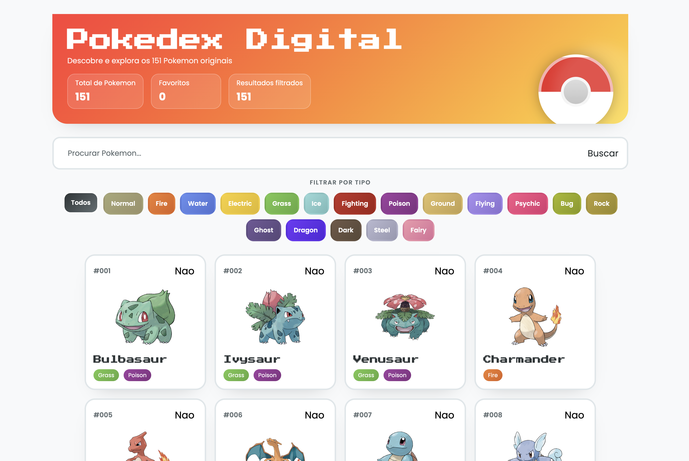
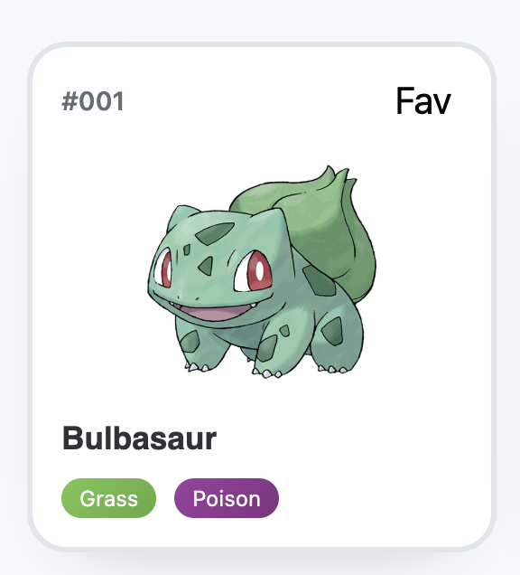
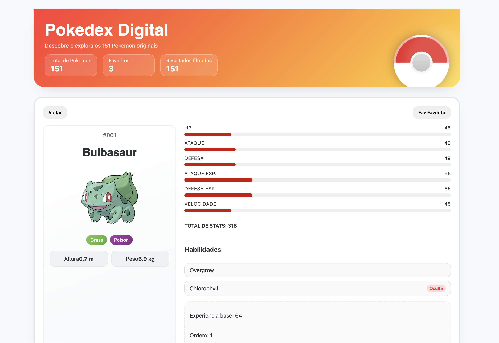

# Tutorial passo a passo — Pokédex Explorer (Ficha 03) (12.º ano)

Este tutorial explica, do início ao fim, como construir a app **pokedex-explorer**.
É uma ficha pensada para consolidar os **8 temas fundamentais de React** (ficheiros 1–8 da pasta React).

> Projeto: **React + Vite** (frontend apenas). Não usamos backend e ainda **não usamos React Router**.

---

## 0) O que vais construir



Uma Pokédex digital com dados reais da **PokéAPI**:

- Lista dos **151 Pokémon (Gen 1)**
- Pesquisa por nome (input controlado)
- Filtro por tipo (botões)
- Favoritos com persistência (`localStorage`)
- Página de detalhes (sem router: navegação por estado)
- Estados de loading, erro e “lista vazia” (renderização condicional)

### 0.1) Ligações diretas aos 8 temas

1. **Fundamentos e setup** — Vite, estrutura base do projeto, `index.html`, `main.jsx`.
2. **JSX e componentes** — dividir UI em componentes pequenos.
3. **Props e composição** — passar dados/handlers do `App` para componentes.
4. **Estado e eventos** — `useState`, handlers, cliques, inputs.
5. **Listas e condicionais** — `map`, `filter`, `&&`, ternários, estados vazios.
6. **Formulários controlados** — input com `value` e `onChange`.
7. **Assíncrono** — `fetch`, `async/await`, `Promise.all`.
8. **useEffect e dados externos** — carregar da API e guardar/ler do `localStorage`.

### 0.2) Mapa de fases (visão rápida)

Se te perderes, volta aqui. Cada fase termina com um checkpoint rápido.

- Fase 1 — App mínimo (renderização): `src/App.jsx`
- Fase 2 — Layout + estados base (SearchBar/TypeFilter): `src/App.jsx`, `src/components/SearchBar.jsx`, `src/components/TypeFilter.jsx`
- Fase 3 — Dados externos + loading/erro (PokéAPI): `src/services/pokeApi.js`, `src/App.jsx`, `src/components/LoadingSpinner.jsx`, `src/components/ErrorMessage.jsx`, `src/components/PokemonCard.jsx`
- Fase 4 — Favoritos + detalhes (navegação por estado): `src/App.jsx`, `src/components/PokemonDetailsPage.jsx`

---

## 1) Pré‑requisitos

- Node.js (18 ou superior)
- npm (vem com o Node)
- VS Code (ou outro editor)
- Terminal aberto numa pasta onde tenhas permissões para criar projetos

Verifica versões:

```bash
node -v
npm -v
```

---

## 2) Criar o projeto com Vite

1. Criar o projeto:

```bash
npm create vite@latest pokedex-explorer -- --template react
```

2. Entrar na pasta:

```bash
cd pokedex-explorer
```

3. Instalar dependências:

```bash
npm install
```

4. Abrir no VS Code:

```bash
code .
```

---

## 3) Limpeza inicial

O Vite cria ficheiros de exemplo. Vamos deixar o projeto “limpo” para começarmos do zero.

- Apaga `src/App.css` (não vamos usar).
- Remove o import `./App.css` do `App.jsx` (se existir).
- Apaga `src/assets/` (imagens de exemplo), se existir.

No fim, deves ter no mínimo:

```
src/
  App.jsx
  main.jsx
```

---

## 4) Alias `@` (muito importante)

Nesta ficha vamos usar imports assim:

```js
import App from "@/App.jsx";
import PokemonCard from "@/components/PokemonCard.jsx";
```

O `@` é um **alias** que aponta para a pasta `src/`. Ou seja, se o ficheiro estiver em `src/components/PokemonCard.jsx`, o import fica mais curto e passa a ser `@/components/PokemonCard.jsx`. Claro que neste caso não ganhamos muito, mas imagina se o ficheiro estivesse em `src/components/pokemon/PokemonCard/index.jsx` — o import ficaria enorme! E dependendo de onde estivesses a importar, podias ter de usar `../../../` várias vezes.
Um exemplo com ganho real: Vamos importar um ficheiro que está 3 pastas acima do ficheiro atual:

```js
import typeData from "../../../typeData.js"; // Sem alias, confuso e propenso a erros
import typeData from "@/typeData.js"; // Com alias, claro e simples
```

O alias refere-se sempre à raiz da pasta `src/`, independentemente de onde estejas a importar.

Para isto funcionar, temos de configurar o Vite.

### 4.1) Criar `vite.config.js` (compatível com ESM)

Vamos usar sintaxe **ESM** (`import`/`export`) no `vite.config.js`.
Por isso, evita `__dirname` (não existe em ESM).

Cria este ficheiro na raiz do projeto: `vite.config.js`

```js
import { defineConfig } from "vite";
import react from "@vitejs/plugin-react";
import path from "node:path";

/**
 * Configuração do Vite.
 *
 * Objetivo: criar o alias "@" para apontar para a pasta "src".
 * Assim, os imports ficam mais curtos e mais fáceis de ler.
 */
export default defineConfig({
    plugins: [react()],
    resolve: {
        alias: {
            "@": path.resolve(process.cwd(), "src"),
        },
    },
});
```

### 4.2) (Recomendado) `jsconfig.json` para o VS Code

O Vite já fica a funcionar com o alias, mas o VS Code pode não “perceber” o `@`.
Para ter autocomplete e para o editor não sublinhar imports, cria `jsconfig.json`:

```json
{
    "compilerOptions": {
        "baseUrl": ".",
        "paths": {
            "@/*": ["src/*"]
        }
    }
}
```

---

## 5) Estrutura de pastas da ficha

Vamos organizar os ficheiros assim:

```
pokedex-explorer/
├─ index.html
├─ package.json
├─ vite.config.js
├─ jsconfig.json
└─ src/
   ├─ main.jsx
   ├─ App.jsx
   ├─ components/
   │  ├─ ErrorMessage.jsx
   │  ├─ LoadingSpinner.jsx
   │  ├─ PokemonCard.jsx
   │  ├─ PokemonDetailsPage.jsx
   │  ├─ SearchBar.jsx
   │  ├─ TypeFilter.jsx
   │  └─ typeData.js
   ├─ services/
   │  └─ pokeApi.js
   └─ styles/
      ├─ index.css
      └─ pokedex.css
```

Cria as pastas:

```bash
mkdir -p src/components src/styles src/services
```

---

## 6) Confirmar o `index.html`

O React precisa de um “ponto de montagem” no HTML.
Abre `index.html` e confirma que existe:

- `<div id="root"></div>`

Exemplo (não tens de decorar isto, é só para perceber a ideia):

```html
<!doctype html>
<html lang="en">
    <head>
        <meta charset="UTF-8" />
        <link rel="icon" type="image/svg+xml" href="/vite.svg" />
        <meta name="viewport" content="width=device-width, initial-scale=1.0" />
        <title>pokedex-explorer</title>
    </head>
    <body>
        <div id="root"></div>
        <script type="module" src="/src/main.jsx"></script>
    </body>
</html>
```

---

## 7) Estilos

Vamos usar dois ficheiros CSS:

- `src/styles/index.css` — estilos globais (fontes, variáveis, reset)
- `src/styles/pokedex.css` — estilos específicos da app

Cria e cola o conteúdo tal como está.

### 7.1) `src/styles/index.css`

```css
/**
 * ============================================
 * ESTILOS GLOBAIS
 * ============================================
 *
 * Descrição: Reset mínimo, tipografia e variáveis globais
 * que servem de base para toda a Pokédex Explorer.
 *
 * CONCEITOS APLICADOS:
 * - Fundamentos (variáveis CSS e tipografia global)
 * - Herança visual (font-family padrão e tamanho base)
 * - Layout global (reset de box-sizing e backgrounds)
 */
@import url("https://fonts.googleapis.com/css2?family=Press+Start+2P&family=Poppins:wght@400;500;600;700;800&display=swap");

:root {
    --primary: #ff1c1c;
    --primary-dark: #cc0000;
    --secondary: #ffd700;
    --accent: #3b4cca;
    --bg-main: #f8f9fa;
    --bg-surface: #ffffff;
    --text-dark: #2d3436;
    --text-muted: #636e72;
    --border: #dfe6e9;
    --shadow-soft: 0 18px 40px -28px rgba(45, 52, 54, 0.35);
    --font-display: "Press Start 2P", sans-serif;
    --font-body: "Poppins", system-ui, sans-serif;
}

*,
*::before,
*::after {
    box-sizing: border-box;
}

body {
    margin: 0;
    font-family: var(--font-body);
    background: var(--bg-main);
    color: var(--text-dark);
    min-height: 100vh;
}

#root {
    min-height: 100vh;
}

button,
input,
select,
textarea {
    font-family: inherit;
    border: none;
    outline: none;
}
```

### 7.2) `src/styles/pokedex.css`

```css
/**
 * ============================================
 * ESTILOS DA POKÉDEX EXPLORER
 * ============================================
 *
 * Descrição: Estilos específicos da aplicação Pokédex Explorer,
 * com hero, cards, filtros, estados especiais e a página de
 * detalhes dos Pokémon.
 *
 * CONCEITOS APLICADOS:
 * - Layout com grid e flex para cards e detalhes
 * - Tipografia personalizada para títulos e corpo
 * - Animações suaves (hover, spinner, bounce)
 */
.pokedex {
    max-width: 1280px;
    margin: 0 auto;
    padding: 32px 24px 48px;
    display: flex;
    flex-direction: column;
    gap: 28px;
    position: relative;
    z-index: 0;
}

.pokedex__hero {
    background: linear-gradient(
        135deg,
        rgba(255, 28, 28, 0.9),
        rgba(255, 214, 0, 0.9)
    );
    border-radius: 0 0 32px 32px;
    padding: 32px;
    color: #fff;
    display: grid;
    grid-template-columns: 1fr auto;
    gap: 28px;
    box-shadow: var(--shadow-soft);
    overflow: hidden;
    position: relative;
}

.pokedex__hero::after {
    content: "";
    position: absolute;
    inset: auto -40px -30px auto;
    width: 200px;
    height: 200px;
    border-radius: 50%;
    background: rgba(255, 255, 255, 0.12);
    filter: blur(12px);
}

.pokedex__hero-title {
    font-family: var(--font-display);
    font-size: clamp(2rem, 3vw, 3rem);
    margin: 0;
}

.pokedex__hero-subtitle {
    margin: 8px 0 16px;
    color: rgba(255, 255, 255, 0.9);
    max-width: 540px;
}

.pokedex__hero-stats {
    display: flex;
    flex-wrap: wrap;
    gap: 16px;
    align-items: center;
}

.pokedex__hero-stat {
    padding: 8px 16px;
    background: rgba(255, 255, 255, 0.12);
    border-radius: 16px;
    border: 1px solid rgba(255, 255, 255, 0.3);
    min-width: 150px;
    font-size: 0.9rem;
}

.pokedex__hero-stat strong {
    display: block;
    font-size: 1.4rem;
    margin-top: 2px;
}

.pokedex__hero-pokeball {
    position: absolute;
    right: 32px;
    bottom: -20px;
    width: 160px;
    height: 160px;
    border-radius: 50%;
    border: 6px solid rgba(255, 255, 255, 0.6);
    animation: float 4s ease-in-out infinite;
    box-shadow: 0 0 28px rgba(0, 0, 0, 0.3);
    background: linear-gradient(
        180deg,
        #eb2a2a 0%,
        #eb2a2a 50%,
        #fff 50%,
        #fff 100%
    );
}

.pokedex__hero-pokeball::after {
    content: "";
    position: absolute;
    inset: 42px;
    border-radius: 50%;
    border: 6px solid rgba(255, 255, 255, 0.8);
    background: linear-gradient(180deg, #d8d8d8 0%, #bcbcbc 100%);
}

.pokedex__hero-pokeball::before {
    content: "";
    position: absolute;
    inset: 62px;
    border-radius: 50%;
    border: 4px solid #2d3436;
    background: #fff;
}

.pokedex__controls {
    display: grid;
    gap: 18px;
}

.search-bar {
    display: flex;
    align-items: center;
    gap: 12px;
    padding: 12px 18px;
    border-radius: 16px;
    border: 3px solid var(--border);
    background: var(--bg-surface);
    box-shadow: inset 0 0 0 1px rgba(255, 255, 255, 0.2);
}

.search-bar__input {
    flex: 1;
    border-radius: 12px;
    border: none;
    font-size: 1rem;
    padding: 8px 12px;
    background: transparent;
    color: var(--text-dark);
}

.search-bar__input::placeholder {
    color: var(--text-muted);
}

.search-bar__icon {
    font-size: 1.2rem;
}

.type-filter {
    display: flex;
    flex-direction: column;
    align-items: center;
    gap: 12px;
}

.type-filter__label {
    font-weight: 600;
    text-transform: uppercase;
    letter-spacing: 0.1em;
    font-size: 0.8rem;
    color: var(--text-muted);
}

.type-filter__buttons {
    display: flex;
    flex-wrap: wrap;
    gap: 10px;
    justify-content: center;
}

.type-filter__button {
    border-radius: 16px;
    padding: 10px 14px;
    color: #fff;
    font-size: 0.85rem;
    font-weight: 600;
    cursor: pointer;
    border: 3px solid transparent;
    transition:
        transform 0.2s ease,
        border-color 0.2s ease;
    text-transform: capitalize;
}

.type-filter__button.active {
    border-color: #fff;
    transform: translateY(-2px);
}

.pokedex__results {
    display: flex;
    flex-direction: column;
    gap: 18px;
}

.pokedex__grid {
    display: grid;
    gap: 18px;
    grid-template-columns: repeat(auto-fit, minmax(220px, 260px));
    justify-content: center;
    grid-auto-rows: 1fr;
}

.pokemon-card {
    background: var(--bg-surface);
    border-radius: 22px;
    border: 3px solid var(--border);
    padding: 16px;
    box-shadow: var(--shadow-soft);
    cursor: pointer;
    transition:
        transform 0.3s ease,
        box-shadow 0.3s ease;
    display: flex;
    flex-direction: column;
    gap: 12px;
}

.pokemon-card:hover {
    transform: translateY(-8px);
    box-shadow: 0 28px 50px -30px rgba(0, 0, 0, 0.5);
}

.pokemon-card__header {
    display: flex;
    justify-content: space-between;
    align-items: center;
}

.pokemon-card__number {
    font-weight: 600;
    font-size: 0.9rem;
    color: var(--text-muted);
}

.pokemon-card__favorite {
    background: transparent;
    border: none;
    font-size: 1.3rem;
    cursor: pointer;
}

.pokemon-card__image {
    width: 100%;
    height: 140px;
    object-fit: contain;
    margin: 0 auto;
}

.pokemon-card__name {
    font-family: var(--font-display);
    text-transform: capitalize;
    font-size: 1.1rem;
    margin: 0;
}

.pokemon-card__types {
    display: flex;
    gap: 10px;
    flex-wrap: wrap;
}

.pokemon-card__type {
    padding: 4px 10px;
    border-radius: 999px;
    font-size: 0.75rem;
    color: #fff;
    text-transform: capitalize;
}

.loading-spinner {
    display: flex;
    align-items: center;
    gap: 16px;
    padding: 18px;
    border-radius: 18px;
    background: var(--bg-surface);
    border: 2px dashed var(--border);
    box-shadow: var(--shadow-soft);
}

.spinner-dot {
    width: 18px;
    height: 18px;
    border-radius: 50%;
    border: 3px solid transparent;
    border-top-color: var(--primary);
    animation: spin 1s linear infinite;
}

.spinner-dot:nth-child(2) {
    border-top-color: var(--secondary);
    animation-duration: 1.2s;
}

.loading-spinner__text {
    font-weight: 600;
}

.error-message {
    padding: 20px;
    border-radius: 18px;
    background: #fff1f1;
    border: 2px solid #ffafaf;
    display: grid;
    gap: 12px;
}

.error-message__title {
    margin: 0;
    font-size: 1.1rem;
    color: var(--text-dark);
}

.error-message__details {
    margin: 0;
    color: #b42318;
}

.error-message__button {
    align-self: flex-start;
    padding: 10px 16px;
    border-radius: 14px;
    background: var(--primary);
    color: #fff;
    border: none;
    cursor: pointer;
    font-weight: 600;
}

.pokedex__empty {
    text-align: center;
    padding: 32px;
    border-radius: 18px;
    border: 2px dashed var(--border);
    background: var(--bg-surface);
    color: var(--text-muted);
}

.pokemon-details {
    background: var(--bg-surface);
    border-radius: 24px;
    border: 3px solid var(--border);
    padding: 24px;
    box-shadow: var(--shadow-soft);
    display: flex;
    flex-direction: column;
    gap: 18px;
}

.pokemon-details__header {
    display: flex;
    justify-content: space-between;
    gap: 12px;
}

.pokemon-details__header button {
    padding: 10px 16px;
    border-radius: 14px;
    border: none;
    cursor: pointer;
    font-weight: 600;
}

.pokemon-details__layout {
    display: grid;
    grid-template-columns: minmax(280px, 1fr) minmax(320px, 2fr);
    gap: 24px;
}

.pokemon-details__sidebar {
    background: linear-gradient(
        160deg,
        rgba(255, 255, 255, 0.95),
        rgba(248, 249, 250, 0.95)
    );
    border-radius: 20px;
    padding: 18px;
    border: 2px solid rgba(0, 0, 0, 0.05);
    display: flex;
    flex-direction: column;
    gap: 18px;
    align-items: center;
}

.pokemon-details__number {
    font-weight: 600;
    color: var(--text-muted);
}

.pokemon-details__name {
    font-family: var(--font-display);
    text-transform: capitalize;
    font-size: 2rem;
    margin: 4px 0;
}

.pokemon-details__image {
    width: 180px;
    height: 180px;
    object-fit: contain;
}

.pokemon-details__types {
    display: flex;
    gap: 8px;
    flex-wrap: wrap;
}

.pokemon-details__type {
    padding: 6px 12px;
    border-radius: 999px;
    font-size: 0.85rem;
    color: #fff;
    text-transform: capitalize;
}

.pokemon-details__measures {
    display: grid;
    grid-template-columns: repeat(2, minmax(0, 1fr));
    gap: 10px;
    width: 100%;
}

.pokemon-details__measure {
    text-align: center;
    background: rgba(45, 52, 54, 0.05);
    padding: 12px;
    border-radius: 12px;
    border: 1px solid rgba(0, 0, 0, 0.05);
}

.pokemon-details__main {
    display: flex;
    flex-direction: column;
    gap: 16px;
}

.pokemon-details__stats {
    display: grid;
    gap: 12px;
}

.stat-row {
    display: grid;
    gap: 6px;
}

.stat-row__label {
    display: flex;
    justify-content: space-between;
    font-size: 0.85rem;
    text-transform: uppercase;
    letter-spacing: 0.06em;
}

.stat-row__bar {
    height: 10px;
    border-radius: 999px;
    background: rgba(45, 52, 54, 0.08);
}

.stat-row__fill {
    height: 100%;
    border-radius: 999px;
    background: var(--primary-dark);
}

.stat-total {
    font-weight: 600;
    text-transform: uppercase;
    font-size: 0.9rem;
}

.pokemon-details__abilities {
    display: grid;
    gap: 10px;
}

.ability-item {
    display: flex;
    justify-content: space-between;
    align-items: center;
    padding: 10px 14px;
    border-radius: 14px;
    border: 1px solid rgba(45, 52, 54, 0.15);
    background: rgba(248, 249, 250, 0.95);
    text-transform: capitalize;
}

.ability-badge {
    padding: 4px 8px;
    border-radius: 999px;
    font-size: 0.75rem;
    font-weight: 600;
    background: rgba(255, 28, 28, 0.15);
    color: var(--primary);
}

.pokemon-details__info {
    border-radius: 16px;
    border: 1px dashed var(--border);
    padding: 14px;
    background: rgba(249, 249, 249, 0.8);
    display: grid;
    gap: 6px;
}

@keyframes bounce {
    0% {
        transform: translateY(0);
    }
    50% {
        transform: translateY(-10px);
    }
    100% {
        transform: translateY(0);
    }
}

@keyframes float {
    0% {
        transform: translateY(0);
    }
    50% {
        transform: translateY(-12px);
    }
    100% {
        transform: translateY(0);
    }
}

@keyframes spin {
    to {
        transform: rotate(360deg);
    }
}

@media (max-width: 960px) {
    .pokedex__hero {
        grid-template-columns: 1fr;
    }

    .pokemon-details__layout {
        grid-template-columns: 1fr;
    }
}

@media (max-width: 640px) {
    .pokedex {
        padding: 24px 16px 40px;
    }

    .search-bar,
    .type-filter {
        flex-direction: column;
    }

    .type-filter {
        gap: 8px;
    }

    .pokedex__grid {
        grid-template-columns: repeat(auto-fit, minmax(180px, 1fr));
    }

    .pokemon-card__header {
        flex-direction: column;
        align-items: flex-start;
        gap: 8px;
    }
}
```

---

## 8) Ponto de entrada: `src/main.jsx`

Este ficheiro é o “arranque” da app.

### 8.1) Teoria

- O browser lê o `index.html`.
- O `index.html` carrega `src/main.jsx`.
- O `main.jsx` renderiza o componente `<App />` dentro do `div#root`.

### 8.2) Prática

Edita `src/main.jsx` para ficar assim (com os imports dos CSS):

```jsx
import React from "react";
import ReactDOM from "react-dom/client";
import App from "@/App.jsx";
import "@/styles/index.css";
import "@/styles/pokedex.css";

/**
 * ============================================
 * PONTO DE ENTRADA
 * ============================================
 *
 * Descrição: Lê o elemento root e monta o componente
 * principal da Pokédex Explorer dentro de React StrictMode.
 *
 * CONCEITOS APLICADOS:
 * - Fundamentos (entrada do React + StrictMode)
 * - Importações relativas via alias Vite (@)
 * - Estilos globais são carregados antes da renderização
 *
 * @returns {void}
 */
ReactDOM.createRoot(document.getElementById("root")).render(
    <React.StrictMode>
        <App />
    </React.StrictMode>,
);
```

---

# Parte A — Construção da UI por componentes

Agora vamos construir a interface por blocos.

Notas importantes:

- O `App.jsx` guarda o **estado global**.
- Os componentes recebem **props** e disparam **eventos** (handlers).

---

## 9) `typeData.js` — Dados e helpers dos tipos

### 9.1) Teoria

Em React (e em programação no geral), compensa separar:

- **Dados** (cores, listas, valores fixos)
- **Lógica** (funções helpers)
- **UI** (componentes)

Assim, quando quiseres mudar cores, não mexes em 3 componentes diferentes.

### 9.2) Prática

Cria `src/components/typeData.js`:

```js
/**
 * ============================================
 * DADOS DOS TIPOS
 * ============================================
 *
 * Descrição: Mapeamento de cores e informações dos 18 tipos
 * originais usados na Pokédex Explorer. Centraliza gradientes
 * e valores para reutilizar em filtros e badges.
 *
 * CONCEITOS APLICADOS:
 * - Separação de dados e lógica visual
 * - Reutilização de helpers em múltiplos componentes
 */
const BASE_COLORS = {
    normal: { base: "#a8a878", dark: "#9a9068" },
    fire: { base: "#f08030", dark: "#d86020" },
    water: { base: "#6890f0", dark: "#5070d0" },
    electric: { base: "#f8d030", dark: "#e0b820" },
    grass: { base: "#78c850", dark: "#60a840" },
    ice: { base: "#98d8d8", dark: "#78b8b8" },
    fighting: { base: "#c03028", dark: "#a02018" },
    poison: { base: "#a040a0", dark: "#803080" },
    ground: { base: "#e0c068", dark: "#c0a050" },
    flying: { base: "#a890f0", dark: "#8870d0" },
    psychic: { base: "#f85888", dark: "#d83870" },
    bug: { base: "#a8b820", dark: "#889810" },
    rock: { base: "#b8a038", dark: "#988828" },
    ghost: { base: "#705898", dark: "#584878" },
    dragon: { base: "#7038f8", dark: "#5028d8" },
    dark: { base: "#705848", dark: "#584838" },
    steel: { base: "#b8b8d0", dark: "#9898b0" },
    fairy: { base: "#ee99ac", dark: "#d87098" },
};

const TYPE_NAMES = [
    "normal",
    "fire",
    "water",
    "electric",
    "grass",
    "ice",
    "fighting",
    "poison",
    "ground",
    "flying",
    "psychic",
    "bug",
    "rock",
    "ghost",
    "dragon",
    "dark",
    "steel",
    "fairy",
];

const DEFAULT_TYPE = "normal";

/**
 * Retorna a cor base de um tipo.
 *
 * @param {string} typeName - Nome do tipo.
 * @returns {string} Cor principal do tipo.
 */
export function getTypeColor(typeName) {
    return BASE_COLORS[typeName]?.base || BASE_COLORS[DEFAULT_TYPE].base;
}

/**
 * Retorna o gradiente associado a um tipo.
 *
 * @param {string} typeName - Nome do tipo.
 * @returns {string} Gradiente linear gerado a partir das cores.
 */
export function getTypeGradient(typeName) {
    const colors = BASE_COLORS[typeName] || BASE_COLORS[DEFAULT_TYPE];
    return `linear-gradient(135deg, ${colors.base}, ${colors.dark})`;
}

/**
 * Lista dos tipos disponíveis (inclui o tipo “all” para filtro global).
 */
export const TYPE_SEQUENCE = ["all", ...TYPE_NAMES];
```

---

## 10) `LoadingSpinner.jsx` — feedback de carregamento

### 10.1) Teoria

Quando vais buscar dados a uma API, há sempre um tempo de espera.
Se não mostrares nada, o utilizador pensa que a app “bloqueou”.

Por isso criamos um componente simples que só aparece quando `loading === true`.

### 10.2) Prática

Cria `src/components/LoadingSpinner.jsx`:

```jsx
/**
 * ============================================
 * LoadingSpinner
 * ============================================
 *
 * Descrição: Indicador visual para períodos de carregamento.
 *
 * CONCEITOS APLICADOS:
 * - Estados de loading (renderização condicional)
 * - Animações CSS para feedback visual
 *
 * @returns {JSX.Element} Spinner com texto.
 */
function LoadingSpinner() {
    return (
        <div className="loading-spinner">
            <span className="spinner-dot" />
            <span className="spinner-dot" />
            <span className="loading-spinner__text">A carregar Pokémon...</span>
        </div>
    );
}

export default LoadingSpinner;
```

---

## 11) `ErrorMessage.jsx` — mensagem de erro e botão de retry

Antes de usares callbacks pela primeira vez neste tutorial, reve a secao "Callbacks e fluxo de dados" em `React/03_props_e_composicao.md#sec-3`.

### 11.1) Teoria

Falhas comuns em pedidos à internet:

- Sem rede
- API em baixo
- Bloqueio temporário

Em vez de “rebentar” a app, guardamos um texto de erro (`error`) e mostramos um componente.

### 11.2) Prática

Cria `src/components/ErrorMessage.jsx`:

```jsx
/**
 * ============================================
 * ErrorMessage
 * ============================================
 *
 * Descrição: Apresenta mensagem de erro e permite retomar o fetch.
 *
 * CONCEITOS APLICADOS:
 * - Tratamento de erros com renderização condicional
 * - Eventos (clique no botão de retry)
 *
 * Props:
 * @param {string} message - Texto do erro a mostrar.
 * @param {() => void} onRetry - Handler chamado ao clicar em "Tentar Novamente".
 *
 * @returns {JSX.Element} Bloco de erro com botão.
 */
function ErrorMessage({ message, onRetry }) {
    return (
        <div className="error-message">
            <p className="error-message__title">Ops! Algo correu mal</p>
            <p className="error-message__details">{message}</p>
            <button
                type="button"
                onClick={onRetry}
                className="error-message__button"
            >
                Tentar Novamente
            </button>
        </div>
    );
}

export default ErrorMessage;
```

---

## 12) `SearchBar.jsx` — formulário controlado

### 12.1) Teoria

Um **input controlado** é um input cujo valor vem do estado.

- O estado está no `App`: `const [searchTerm, setSearchTerm] = useState("")`
- O `SearchBar` recebe `value` e `onChange` por props.
- Quando o utilizador escreve, o `SearchBar` chama `onChange(novoValor)`.
- O `App` atualiza o estado e o input muda sozinho.

Isto parece “mais trabalho”, mas dá-te controlo total do formulário.

### 12.2) Prática

Cria `src/components/SearchBar.jsx`:

```jsx
/**
 * ============================================
 * SearchBar
 * ============================================
 *
 * Descrição: Input controlado que permite pesquisar nomes de Pokémon
 * em tempo real e demonstra formulários controlados + eventos.
 *
 * CONCEITOS APLICADOS:
 * - Formulários controlados (value e onChange)
 * - Eventos (onChange em input)
 * - Props e composição (App fornece dados e handler)
 *
 * Props:
 * @param {string} value - Termo atual de busca.
 * @param {(value: string) => void} onChange - Handler para atualizar o termo.
 *
 * @returns {JSX.Element} Campo de pesquisa estilizado.
 */
function SearchBar({ value, onChange }) {
    /**
     * Atualiza o termo de pesquisa quando o utilizador escreve.
     *
     * @param {React.ChangeEvent<HTMLInputElement>} event - Evento do input.
     */
    function handleInputChange(event) {
        onChange(event.target.value);
    }

    return (
        <div className="search-bar">
            <input
                className="search-bar__input"
                type="search"
                autoComplete="off"
                value={value}
                onChange={handleInputChange}
                placeholder="Procurar Pokémon..."
                aria-label="Pesquisar Pokémon por nome"
            />
            <span className="search-bar__icon" aria-hidden="true">
                🔍
            </span>
        </div>
    );
}

export default SearchBar;
```

---

## 13) `TypeFilter.jsx` — filtros por tipo

### 13.1) Teoria

Aqui treinamos 3 coisas importantes:

1. **Listas em React** com `map`
2. **Props** (`selectedType`) para saber qual botão está ativo
3. **Eventos** (`onTypeChange`) para avisar o `App` de uma mudança

### 13.2) Prática

Cria `src/components/TypeFilter.jsx`:

```jsx
import { getTypeGradient, TYPE_SEQUENCE } from "@/components/typeData.js";

/**
 * ============================================
 * TypeFilter
 * ============================================
 *
 * Descrição: Botões de filtro que permitem alternar por tipo de Pokémon.
 *
 * CONCEITOS APLICADOS:
 * - Props e composição (passagem de selectedType + onTypeChange)
 * - Eventos (clique em botões)
 * - Renderização condicional (classe activa)
 *
 * Props:
 * @param {string} selectedType - Tipo atualmente selecionado.
 * @param {(type: string) => void} onTypeChange - Handler para alterar o tipo.
 *
 * @returns {JSX.Element} Filtros por tipo com gradientes.
 */
function TypeFilter({ selectedType, onTypeChange }) {
    /**
     * Dispara o handler externo com o tipo alvo.
     *
     * @param {string} type - Tipo clicado.
     */
    function handleTypeChange(type) {
        onTypeChange(type);
    }

    return (
        <div className="type-filter">
            <span className="type-filter__label">Filtrar por Tipo</span>
            <div className="type-filter__buttons">
                {TYPE_SEQUENCE.map((type) => {
                    const gradient =
                        type === "all"
                            ? "linear-gradient(135deg, #2d3436, #636e72)"
                            : getTypeGradient(type);

                    return (
                        <button
                            key={type}
                            type="button"
                            className={`type-filter__button${
                                selectedType === type ? " active" : ""
                            }`}
                            style={{ background: gradient }}
                            onClick={() => handleTypeChange(type)}
                        >
                            {type === "all" ? "Todos" : type}
                        </button>
                    );
                })}
            </div>
        </div>
    );
}

export default TypeFilter;
```

---

## 14) `PokemonCard.jsx` — card de um Pokémon



### 14.1) Teoria

O card tem dois cliques diferentes:

- Clicar no card → abrir detalhes
- Clicar no botão de favorito → alternar favorito

Como o botão está _dentro_ do card, temos de impedir que o clique do botão “suba” para o card.
Para isso usamos `event.stopPropagation()`.

### 14.2) Prática

Cria `src/components/PokemonCard.jsx`:

```jsx
import { getTypeGradient } from "@/components/typeData.js";

/**
 * ============================================
 * PokemonCard
 * ============================================
 *
 * Descrição: Cartão individual com número, imagem,
 * tipos e favorito, usado na lista principal.
 *
 * CONCEITOS APLICADOS:
 * - Props e composição (dados e handlers entram via props)
 * - Eventos (click no card + button de favorito)
 * - Renderização condicional (círculo de favorito)
 * - Listas e acesso a propriedades de objetos (map dos tipos)
 *
 * Props:
 * @param {object} pokemon - Dados completos do Pokémon.
 * @param {boolean} isFavorite - Indica se está nos favoritos.
 * @param {(id: number) => void} onToggleFavorite - Alterna favorito.
 * @param {(pokemon: object) => void} onClick - Mostra detalhes.
 *
 * @returns {JSX.Element} Cartão estilizado do Pokémon.
 */
function PokemonCard({ pokemon, isFavorite, onToggleFavorite, onClick }) {
    /**
     * Handler do clique no botão de favorito.
     *
     * @param {React.MouseEvent<HTMLButtonElement>} event - Evento do clique.
     */
    function handleFavoriteClick(event) {
        event.stopPropagation();
        onToggleFavorite(pokemon.id);
    }

    /**
     * Abre a vista de detalhes.
     */
    function handleCardClick() {
        onClick(pokemon);
    }

    const pokemonNumber = `#${String(pokemon.id).padStart(3, "0")}`;
    const artwork =
        pokemon.sprites?.other?.["official-artwork"]?.front_default ||
        pokemon.sprites?.front_default ||
        "";

    return (
        <article className="pokemon-card" onClick={handleCardClick}>
            <div className="pokemon-card__header">
                <span className="pokemon-card__number">{pokemonNumber}</span>
                <button
                    className="pokemon-card__favorite"
                    type="button"
                    onClick={handleFavoriteClick}
                    aria-label={
                        isFavorite
                            ? "Remover dos favoritos"
                            : "Adicionar aos favoritos"
                    }
                >
                    {isFavorite ? "❤️" : "🤍"}
                </button>
            </div>
            
            <h3 className="pokemon-card__name">{pokemon.name}</h3>
            <div className="pokemon-card__types">
                {pokemon.types.map((typeInfo) => {
                    const typeName = typeInfo.type.name;
                    const gradient = getTypeGradient(typeName);
                    return (
                        <span
                            key={typeName}
                            className="pokemon-card__type"
                            style={{ background: gradient }}
                        >
                            {typeName}
                        </span>
                    );
                })}
            </div>
        </article>
    );
}

export default PokemonCard;
```

---

## 15) `PokemonDetailsPage.jsx` — página de detalhes



### 15.1) Teoria

Como ainda não estamos a usar React Router, a “navegação” é feita por estado.

- No `App`, guardamos qual é a página atual (`currentPage`).
- Guardamos também o Pokémon selecionado (`selectedPokemon`).
- Quando clicas num card: `setSelectedPokemon(p)` e `setCurrentPage("details")`.
- Quando clicas em voltar: voltamos a `list`.

### 15.2) Prática

Cria `src/components/PokemonDetailsPage.jsx`:

```jsx
import { getTypeGradient } from "@/components/typeData.js";

// Rótulos legíveis para os stats dos Pokémon.
const STAT_LABELS = {
    hp: "HP",
    attack: "Ataque",
    defense: "Defesa",
    "special-attack": "Ataque Esp.",
    "special-defense": "Defesa Esp.",
    speed: "Velocidade",
};

/**
 * ============================================
 * PokemonDetailsPage
 * ============================================
 *
 * Descrição: Página detalhada de cada Pokémon com layout em duas
 * colunas e barra de stats.
 *
 * CONCEITOS APLICADOS:
 * - Estado e eventos (navegação por estados + favoritos)
 * - Listas (stats, tipos e habilidades)
 * - Condicionais (modo vazio, badges de oculto e botões)
 *
 * Props:
 * @param {object} pokemon - Dados completos do Pokémon selecionado.
 * @param {boolean} isFavorite - Indica se o Pokémon é favorito.
 * @param {(id: number) => void} onToggleFavorite - Alterna favorito.
 * @param {() => void} onBack - Volta para a lista principal.
 *
 * @returns {JSX.Element} Página de detalhes completa.
 */
function PokemonDetailsPage({ pokemon, isFavorite, onToggleFavorite, onBack }) {
    const formattedNumber = `#${String(pokemon.id).padStart(3, "0")}`;
    const heightInMetres = (pokemon.height / 10).toFixed(1);
    const weightInKg = (pokemon.weight / 10).toFixed(1);
    const statsTotal = pokemon.stats.reduce(
        (sum, stat) => sum + stat.base_stat,
        0,
    );

    /**
     * Alterna favorito a partir do botão da página de detalhes.
     */
    function handleFavoriteClick() {
        onToggleFavorite(pokemon.id);
    }

    /**
     * Retorna o rótulo do stat em português.
     *
     * @param {string} statName - Nome técnico do stat.
     * @returns {string} Rótulo legível.
     */
    function getStatLabel(statName) {
        return STAT_LABELS[statName] || statName;
    }

    return (
        <article className="pokemon-details">
            <header className="pokemon-details__header">
                <button type="button" onClick={onBack}>
                    ← Voltar
                </button>
                <button type="button" onClick={handleFavoriteClick}>
                    {isFavorite ? "❤️ Favorito" : "🤍 Favorito"}
                </button>
            </header>

            <div className="pokemon-details__layout">
                <aside className="pokemon-details__sidebar">
                    <span className="pokemon-details__number">
                        {formattedNumber}
                    </span>
                    <h2 className="pokemon-details__name">{pokemon.name}</h2>
                    
                    <div className="pokemon-details__types">
                        {pokemon.types.map((typeInfo) => (
                            <span
                                key={typeInfo.type.name}
                                className="pokemon-details__type"
                                style={{
                                    background: getTypeGradient(
                                        typeInfo.type.name,
                                    ),
                                }}
                            >
                                {typeInfo.type.name}
                            </span>
                        ))}
                    </div>
                    <div className="pokemon-details__measures">
                        <div className="pokemon-details__measure">
                            <span>Altura</span>
                            <strong>{heightInMetres} m</strong>
                        </div>
                        <div className="pokemon-details__measure">
                            <span>Peso</span>
                            <strong>{weightInKg} kg</strong>
                        </div>
                    </div>
                </aside>

                <section className="pokemon-details__main">
                    <div className="pokemon-details__stats">
                        {pokemon.stats.map((stat) => {
                            const statLabel = getStatLabel(stat.stat.name);
                            const progress = Math.min(stat.base_stat, 255);
                            const width = (progress / 255) * 100;
                            return (
                                <div className="stat-row" key={stat.stat.name}>
                                    <div className="stat-row__label">
                                        <span>{statLabel}</span>
                                        <span>{stat.base_stat}</span>
                                    </div>
                                    <div className="stat-row__bar">
                                        <div
                                            className="stat-row__fill"
                                            style={{ width: `${width}%` }}
                                        />
                                    </div>
                                </div>
                            );
                        })}
                    </div>

                    <p className="stat-total">Total de stats: {statsTotal}</p>

                    <div className="pokemon-details__abilities">
                        <h3>Habilidades</h3>
                        {pokemon.abilities.map((abilityInfo) => (
                            <div
                                className="ability-item"
                                key={abilityInfo.ability.name}
                            >
                                <span>{abilityInfo.ability.name}</span>
                                {abilityInfo.is_hidden && (
                                    <span className="ability-badge">
                                        Oculta
                                    </span>
                                )}
                            </div>
                        ))}
                    </div>

                    <div className="pokemon-details__info">
                        <p>Experiência base: {pokemon.base_experience}</p>
                        <p>Ordem: {pokemon.order}</p>
                    </div>
                </section>
            </div>
        </article>
    );
}

export default PokemonDetailsPage;
```

---

# Parte B — App.jsx em fases (muito importante)

O `App.jsx` é o componente principal.
É normal ser o ficheiro maior, porque é ele que junta tudo:

- estado global
- fetch à API
- filtros
- favoritos
- navegação (lista/detalhes)
- renderização condicional

Para não ser confuso, vamos construir em **4 fases**.

---

## 16) Fase 1 — App mínimo (confirmar renderização)

### 16.1) Teoria (curta)

Objetivo: confirmar que o React está a funcionar e que os estilos estão a ser carregados.

Nesta fase o foco é só garantir que o `App` renderiza sem erros.

### 16.2) Prática

Substitui temporariamente `src/App.jsx` por isto:

```jsx
/**
 * ============================================
 * App (Fase 1)
 * ============================================
 *
 * Objetivo: confirmar que o React está a renderizar.
 * Ainda não há estados, nem API, nem componentes.
 */
function App() {
    return (
        <div className="pokedex">
            <h1>Pokédex Explorer</h1>
            <p>Se estás a ver isto no browser, o React está ok.</p>
        </div>
    );
}

export default App;
```

Corre:

```bash
npm run dev
```

Se aparece o título, podes avançar.

### 16.3) Checkpoint rápido

- Vês o texto “Pokédex Explorer” no browser.
- Não há erros no terminal nem no console do browser.

---

## 17) Fase 2 — Layout base + estados mínimos

### 17.1) Teoria (curta)

Objetivo: montar o hero, a zona de controlos e o “esqueleto” da página.

Nesta fase já importamos componentes, mas ainda não fazemos `fetch`.

### 17.2) Prática

Substitui `src/App.jsx` por esta versão (repara nos comentários):

```jsx
import { useState } from "react";
import SearchBar from "@/components/SearchBar.jsx";
import TypeFilter from "@/components/TypeFilter.jsx";

/**
 * ============================================
 * App (Fase 2)
 * ============================================
 *
 * Objetivo desta fase:
 * - Montar o layout base (hero + controlos)
 * - Criar estados mínimos para o SearchBar e TypeFilter
 *
 * Nota: ainda NÃO estamos a carregar Pokémon.
 */
function App() {
    // Estado do formulário controlado
    const [searchTerm, setSearchTerm] = useState("");

    // Estado do filtro por tipo
    const [selectedType, setSelectedType] = useState("all");

    /**
     * Handler do SearchBar.
     * Repara: o SearchBar não altera estado sozinho.
     * Ele chama este handler e o App atualiza o estado.
     *
     * @param {string} value
     */
    function handleSearchChange(value) {
        setSearchTerm(value);
    }

    /**
     * Handler do TypeFilter.
     * @param {string} type
     */
    function handleTypeChange(type) {
        setSelectedType(type);
    }

    return (
        <div className="pokedex">
            <header className="pokedex__hero">
                <div>
                    <h1 className="pokedex__hero-title">Pokédex Digital</h1>
                    <p className="pokedex__hero-subtitle">
                        Nesta fase ainda não há dados — só estamos a testar UI e
                        estados.
                    </p>
                    <div className="pokedex__hero-stats">
                        <div className="pokedex__hero-stat">
                            Total de Pokémon
                            <strong>151</strong>
                        </div>
                        <div className="pokedex__hero-stat">
                            Favoritos
                            <strong>0</strong>
                        </div>
                        <div className="pokedex__hero-stat">
                            Resultados filtrados
                            <strong>0</strong>
                        </div>
                    </div>
                </div>
                <div className="pokedex__hero-pokeball" aria-hidden="true" />
            </header>

            <section className="pokedex__controls">
                <SearchBar value={searchTerm} onChange={handleSearchChange} />
                <TypeFilter
                    selectedType={selectedType}
                    onTypeChange={handleTypeChange}
                />
            </section>
        </div>
    );
}

export default App;
```

### 17.3) Checkpoint rápido

- Escreve no input e confirma que o texto aparece no input (está controlado).
- Clica em tipos e confirma que o botão ativo muda (classe `active`).

---

## 18) Fase 3 — Carregar dados da PokéAPI (fetch + useEffect)

Agora vamos buscar dados reais.

### 18.1) Teoria (curta, mas importante)

- `fetch(url)` devolve uma **Promise**.
- `await fetch(url)` espera pela resposta.
- `response.ok` diz se correu bem.
- `await response.json()` dá-te os dados.

Vamos fazer 2 passos:

1. ir buscar a lista de 151 (nome + url)
2. ir buscar os detalhes de cada um, em paralelo, com `Promise.all`

### 18.2) Prática — criar helper da API

Para manter o `App.jsx` mais limpo (estilo profissional), vamos isolar a lógica de fetch num helper.

Cria `src/services/pokeApi.js`:

```js
const API_BASE = "https://pokeapi.co/api/v2";

/**
 * Vai buscar a lista base e depois os detalhes de cada Pokémon.
 *
 * @param {number} limit - Quantos Pokémon carregar.
 * @returns {Promise<Array>} Lista detalhada de Pokémon.
 */
export async function fetchPokemonList(limit = 151) {
    const response = await fetch(`${API_BASE}/pokemon?limit=${limit}`);
    if (!response.ok) {
        throw new Error("Não foi possível carregar a lista.");
    }

    const data = await response.json();

    const detailedPokemon = await Promise.all(
        data.results.map(async (entry) => {
            const detailResponse = await fetch(entry.url);
            if (!detailResponse.ok) {
                throw new Error(`Erro ao carregar ${entry.name}`);
            }
            return detailResponse.json();
        }),
    );

    return detailedPokemon;
}
```

### 18.3) Prática — App com dados

Notas didáticas antes do código:

- `useCallback` evita recriar a função de carregamento a cada render, o que previne loops no `useEffect`.
- O helper usa `Promise.all` para fazer pedidos de detalhe em paralelo.
- Guardamos uma mensagem “segura” em `error` para mostrar na UI.

Vamos criar agora estados para dados e erros e um `useEffect` para carregar ao iniciar.

Substitui `src/App.jsx` por esta versão (ainda sem favoritos e sem detalhes):

```jsx
import { useCallback, useEffect, useState } from "react";
import ErrorMessage from "@/components/ErrorMessage.jsx";
import LoadingSpinner from "@/components/LoadingSpinner.jsx";
import PokemonCard from "@/components/PokemonCard.jsx";
import SearchBar from "@/components/SearchBar.jsx";
import TypeFilter from "@/components/TypeFilter.jsx";
import { fetchPokemonList } from "@/services/pokeApi.js";

const POKEMON_LIMIT = 151;

/**
 * ============================================
 * App (Fase 3)
 * ============================================
 *
 * Objetivo:
 * - carregar dados da PokéAPI
 * - mostrar loading e erro
 * - renderizar lista de cards (ainda sem favoritos/detalhes)
 */
function App() {
    // Dados
    const [pokemon, setPokemon] = useState([]);

    // Estados típicos de dados externos
    const [loading, setLoading] = useState(true);
    const [error, setError] = useState(null);

    // Estados da UI (filtros)
    const [searchTerm, setSearchTerm] = useState("");
    const [selectedType, setSelectedType] = useState("all");

    const loadPokemonList = useCallback(async () => {
        setLoading(true);
        setError(null);
        try {
            const detailedPokemon = await fetchPokemonList(POKEMON_LIMIT);
            setPokemon(detailedPokemon);
        } catch (err) {
            // Guardamos uma mensagem “segura” para mostrar no UI.
            const message =
                err instanceof Error ? err.message : "Erro desconhecido";
            setError(message);
        } finally {
            setLoading(false);
        }
    }, [fetchPokemonList]);

    // Carregar automaticamente ao iniciar.
    useEffect(() => {
        loadPokemonList();
    }, [loadPokemonList]);

    /** @param {string} value */
    function handleSearchChange(value) {
        setSearchTerm(value);
    }

    /** @param {string} type */
    function handleTypeChange(type) {
        setSelectedType(type);
    }

    // Filtragem (já treinamos ficheiro 5: listas/condicionais)
    const filteredPokemon = pokemon.filter((poke) => {
        const matchesSearch = poke.name
            .toLowerCase()
            .includes(searchTerm.trim().toLowerCase());

        const matchesType =
            selectedType === "all" ||
            poke.types.some((typeInfo) => typeInfo.type.name === selectedType);

        return matchesSearch && matchesType;
    });

    const resultsCount = filteredPokemon.length;

    function handleRetry() {
        loadPokemonList();
    }

    return (
        <div className="pokedex">
            <header className="pokedex__hero">
                <div>
                    <h1 className="pokedex__hero-title">Pokédex Digital</h1>
                    <p className="pokedex__hero-subtitle">
                        Agora já estamos a carregar dados reais da PokéAPI.
                    </p>
                    <div className="pokedex__hero-stats">
                        <div className="pokedex__hero-stat">
                            Total de Pokémon
                            <strong>{pokemon.length || POKEMON_LIMIT}</strong>
                        </div>
                        <div className="pokedex__hero-stat">
                            Resultados filtrados
                            <strong>{resultsCount}</strong>
                        </div>
                    </div>
                </div>
                <div className="pokedex__hero-pokeball" aria-hidden="true" />
            </header>

            <section className="pokedex__controls">
                <SearchBar value={searchTerm} onChange={handleSearchChange} />
                <TypeFilter
                    selectedType={selectedType}
                    onTypeChange={handleTypeChange}
                />
            </section>

            <section className="pokedex__results">
                {loading && <LoadingSpinner />}
                {error && (
                    <ErrorMessage message={error} onRetry={handleRetry} />
                )}

                {!loading && !error && resultsCount === 0 && (
                    <p className="pokedex__empty">
                        Nenhum Pokémon encontrado. Ajusta a pesquisa ou o filtro
                        de tipo.
                    </p>
                )}

                {!loading && !error && resultsCount > 0 && (
                    <div className="pokedex__grid">
                        {filteredPokemon.map((poke) => (
                            <PokemonCard
                                key={poke.id}
                                pokemon={poke}
                                isFavorite={false}
                                onToggleFavorite={() => {}}
                                onClick={() => {}}
                            />
                        ))}
                    </div>
                )}
            </section>
        </div>
    );
}

export default App;
```

**Observações (React 18 + StrictMode):**

- Em desenvolvimento, o `<React.StrictMode>` pode executar o `useEffect` duas vezes, por isso o `fetch` pode acontecer 2x.
- Isto só acontece em dev; no build de produção não acontece.
- Não removas o StrictMode. É normal veres pedidos duplicados no Network.

**Observações (Dev vs Prod):**

- **Dev** é o modo de desenvolvimento local (`npm run dev`): mais avisos e verificações. É normal ver efeitos duplicados.
- **Prod** é o build final (`npm run build` + `npm run preview`): código otimizado, mais rápido e sem efeitos duplicados do StrictMode. É o código que vai ser colocado no servidor.
- Se vires comportamento “estranho” em dev (duplicações, logs extra), confirma se acontece também em prod.

Nesta fase, os cards já aparecem, mas ainda não fazem nada ao clicar e ainda não há favoritos.

### 18.4) Checkpoint rápido

- Ao abrir a app, aparece o `LoadingSpinner` e depois a grelha de Pokémon.
- Se desligares a net (ou mudares temporariamente a URL no helper), aparece o `ErrorMessage`.
- A pesquisa por nome e o filtro por tipo já reduzem a lista.

---

## 19) Fase 4 — Favoritos + navegação para detalhes (versão final)

### 19.1) Teoria (curta)

Agora vamos juntar as últimas peças:

- Favoritos no estado + `localStorage`
- `currentPage` + `selectedPokemon`
- Usar `PokemonDetailsPage`

A partir daqui, podes usar a versão final (a que tens no projeto).

Notas didáticas (mantém os detalhes que antes estavam nos comentários do código):

- **Promise.all**: vamos buscar a lista base e, para cada Pokémon, pedimos os detalhes; `Promise.all` espera que todas essas promessas terminem antes de atualizar o estado.
- **async/await + useCallback**: a função de carregamento é assíncrona; se a resposta não for `ok`, lançamos erro e tratamos no `catch`. O `useCallback` evita recriar a função em cada render.
- **localStorage**: é uma API de armazenamento no browser (chave‑valor). Guardamos favoritos em `"pokemonFavorites"`, com `JSON.stringify` ao guardar e `JSON.parse` ao ler.
- **Navegação sem router**: ao clicar num card, guardamos o Pokémon em `selectedPokemon` e mudamos `currentPage` para `"details"`. Para voltar, limpamos o estado.

Conceitos aplicados:

- Fundamentos e setup (estrutura principal + estilos globais)
- JSX e componentes (layout com hero, cards e detalhes)
- Props e composição (todos os componentes recebem handlers e dados)
- Estado e eventos (useState para carregamento, favoritos e navegação)
- Listas e condicionais (map, filter, estados de erro/carregamento)
- Formulários controlados (SearchBar com value e onChange)
- Comunicação assíncrona (fetch e Promise.all para carregar 151 Pokémon)
- useEffect e dados externos (useEffect para carregar API e localStorage)

Descrição: componente principal da Pokédex Explorer. Reúne cabeçalho, navegação por estados, filtros e renderização de cards com dados reais.

### 19.2) Prática — código final do `App.jsx`

Substitui o teu `src/App.jsx` por este ficheiro (é o final).
Lê com calma o código e as notas acima: isto é literalmente a ficha toda num único componente.

```jsx
import { useCallback, useEffect, useState } from "react";
import ErrorMessage from "@/components/ErrorMessage.jsx";
import LoadingSpinner from "@/components/LoadingSpinner.jsx";
import PokemonCard from "@/components/PokemonCard.jsx";
import PokemonDetailsPage from "@/components/PokemonDetailsPage.jsx";
import SearchBar from "@/components/SearchBar.jsx";
import TypeFilter from "@/components/TypeFilter.jsx";
import { fetchPokemonList } from "@/services/pokeApi.js";

const POKEMON_LIMIT = 151;

/**
 * App — componente principal da Pokédex Explorer.
 *
 * @returns {JSX.Element}
 */
function App() {
    // ========================================
    // ESTADO (Ficheiro 4: Estado e eventos)
    // ========================================
    const [pokemon, setPokemon] = useState([]);
    const [loading, setLoading] = useState(true);
    const [error, setError] = useState(null);
    const [searchTerm, setSearchTerm] = useState("");
    const [selectedType, setSelectedType] = useState("all");
    const [currentPage, setCurrentPage] = useState("list");
    const [selectedPokemon, setSelectedPokemon] = useState(null);
    const [favorites, setFavorites] = useState([]);

    const loadPokemonList = useCallback(async () => {
        setLoading(true);
        setError(null);
        try {
            const detailedPokemon = await fetchPokemonList(POKEMON_LIMIT);
            setPokemon(detailedPokemon);
        } catch (err) {
            const message =
                err instanceof Error ? err.message : "Erro desconhecido";
            setError(message);
        } finally {
            setLoading(false);
        }
    }, [fetchPokemonList]);

    // ========================================
    // EFEITOS (Ficheiro 8: useEffect e dados externos)
    // ========================================

    // Carrega dados quando o componente é montado.
    useEffect(() => {
        loadPokemonList();
    }, [loadPokemonList]);

    // Carrega favoritos guardados.
    useEffect(() => {
        const storedFavorites = localStorage.getItem("pokemonFavorites");
        if (storedFavorites) {
            setFavorites(JSON.parse(storedFavorites));
        }
    }, []);

    // Persiste favoritos sempre que mudam.
    useEffect(() => {
        localStorage.setItem("pokemonFavorites", JSON.stringify(favorites));
    }, [favorites]);

    /**
     * Alterna um Pokémon nos favoritos usando o valor mais recente.
     *
     * @param {number} id - ID do Pokémon.
     */
    function toggleFavorite(id) {
        setFavorites((prev) => {
            if (prev.includes(id)) {
                return prev.filter((favId) => favId !== id);
            }
            return [...prev, id];
        });
    }

    /**
     * Handler quando um card é clicado. Passa para a página de detalhes.
     *
     * @param {object} pokemonItem - Pokémon selecionado.
     */
    function handlePokemonClick(pokemonItem) {
        setSelectedPokemon(pokemonItem);
        setCurrentPage("details");
    }

    /**
     * Volta para a lista e limpa o Pokémon selecionado.
     */
    function handleBackToList() {
        setCurrentPage("list");
        setSelectedPokemon(null);
    }

    /**
     * Atualiza o termo de pesquisa (input controlado).
     *
     * @param {string} value - Novo valor.
     */
    function handleSearchChange(value) {
        setSearchTerm(value);
    }

    /**
     * Altera o filtro de tipo.
     *
     * @param {string} type - Tipo escolhido.
     */
    function handleTypeChange(type) {
        setSelectedType(type);
    }

    // ========================================
    // FILTRAGEM (Ficheiro 5: Listas e condicionais)
    // ========================================
    const filteredPokemon = pokemon.filter((poke) => {
        const matchesSearch = poke.name
            .toLowerCase()
            .includes(searchTerm.trim().toLowerCase());
        const matchesType =
            selectedType === "all" ||
            poke.types.some((typeInfo) => typeInfo.type.name === selectedType);
        return matchesSearch && matchesType;
    });

    const favoritesCount = favorites.length;
    const resultsCount = filteredPokemon.length;
    const heroTotal = pokemon.length || POKEMON_LIMIT;

    const showList = currentPage === "list";
    const showDetails = currentPage === "details" && selectedPokemon;

    /**
     * Tenta recarregar os dados da API e regressa à lista.
     */
    function handleRetry() {
        setCurrentPage("list");
        setSelectedPokemon(null);
        loadPokemonList();
    }

    return (
        <div className="pokedex">
            <header className="pokedex__hero">
                <div>
                    <h1 className="pokedex__hero-title">Pokédex Digital</h1>
                    <p className="pokedex__hero-subtitle">
                        Descobre e explora os 151 Pokémon originais
                    </p>
                    <div className="pokedex__hero-stats">
                        <div className="pokedex__hero-stat">
                            Total de Pokémon
                            <strong>{heroTotal}</strong>
                        </div>
                        <div className="pokedex__hero-stat">
                            Favoritos
                            <strong>{favoritesCount}</strong>
                        </div>
                        <div className="pokedex__hero-stat">
                            Resultados filtrados
                            <strong>{resultsCount}</strong>
                        </div>
                    </div>
                </div>
                <div className="pokedex__hero-pokeball" aria-hidden="true" />
            </header>

            {showList && (
                <>
                    <section className="pokedex__controls">
                        <SearchBar
                            value={searchTerm}
                            onChange={handleSearchChange}
                        />
                        <TypeFilter
                            selectedType={selectedType}
                            onTypeChange={handleTypeChange}
                        />
                    </section>

                    <section className="pokedex__results">
                        {loading && <LoadingSpinner />}
                        {error && (
                            <ErrorMessage
                                message={error}
                                onRetry={handleRetry}
                            />
                        )}
                        {!loading && !error && resultsCount === 0 && (
                            <p className="pokedex__empty">
                                Nenhum Pokémon encontrado. Ajusta a pesquisa ou
                                o filtro de tipo.
                            </p>
                        )}
                        {!loading && !error && resultsCount > 0 && (
                            <div className="pokedex__grid">
                                {filteredPokemon.map((poke) => (
                                    <PokemonCard
                                        key={poke.id}
                                        pokemon={poke}
                                        isFavorite={favorites.includes(poke.id)}
                                        onToggleFavorite={toggleFavorite}
                                        onClick={handlePokemonClick}
                                    />
                                ))}
                            </div>
                        )}
                    </section>
                </>
            )}

            {showDetails && selectedPokemon && (
                <PokemonDetailsPage
                    pokemon={selectedPokemon}
                    isFavorite={favorites.includes(selectedPokemon.id)}
                    onToggleFavorite={toggleFavorite}
                    onBack={handleBackToList}
                />
            )}
        </div>
    );
}

export default App;
```

### 19.3) Checkpoint rápido

- Favoritos guardam ao fazer refresh (localStorage).
- Clicar num card abre detalhes; clicar em “Voltar” regressa à lista.
- O contador de favoritos e o total filtrado mudam corretamente.

### 19.4) O que deves conseguir explicar no fim

Se eu te perguntasse na aula, tu devias conseguir explicar:

- porque é que precisamos de `useState`
- o que faz o `useEffect` e porque tem dependências
- o que é um componente controlado (SearchBar)
- o que é `map` e porque é que o `key` é obrigatório
- o que é `filter` e como aplicaste 2 filtros ao mesmo tempo
- para que serve `Promise.all`
- porque é que guardamos favoritos no `localStorage`
- como é que fazemos “navegação” sem router (estado + render condicional)

---

## 20) Estrutura final (check rápido)

```
pokedex-explorer/
├─ index.html
├─ package.json
├─ vite.config.js
├─ jsconfig.json
└─ src/
   ├─ App.jsx
   ├─ main.jsx
   ├─ components/
   │  ├─ ErrorMessage.jsx
   │  ├─ LoadingSpinner.jsx
   │  ├─ PokemonCard.jsx
   │  ├─ PokemonDetailsPage.jsx
   │  ├─ SearchBar.jsx
   │  ├─ TypeFilter.jsx
   │  └─ typeData.js
   ├─ services/
   │  └─ pokeApi.js
   └─ styles/
      ├─ index.css
      └─ pokedex.css
```

---

## 21) Executar o projeto

No terminal:

```bash
npm run dev
```

Depois abre o endereço que o Vite te der.

---

## 22) Checklist final (para entregar)

- [ ] `vite.config.js` com alias `@`
- [ ] `jsconfig.json` (recomendado)
- [ ] `main.jsx` importa os CSS
- [ ] `src/services/pokeApi.js` criado e a ser usado no `App.jsx`
- [ ] Mostra **loading** durante o fetch
- [ ] Mostra **erro** e botão de retry quando falha
- [ ] Pesquisa por nome funciona
- [ ] Filtro por tipo funciona
- [ ] Favoritos persistem ao fazer refresh
- [ ] Clicar num card abre detalhes e o botão “Voltar” funciona

---

## 23) Exercícios de consolidação

1. **Só favoritos**: cria um toggle e mostra apenas os favoritos.
2. **Ordenar**: adiciona um seletor (por id asc/desc, por nome).
3. **Limpar filtros**: botão que limpa `searchTerm` e `selectedType`.
4. **Contador de carregados**: enquanto faz fetch, mostra `X / 151`.
5. **Acessibilidade**: adiciona `aria-label` aos botões do filtro.

---

Fim.
